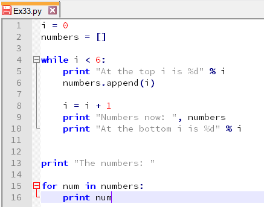
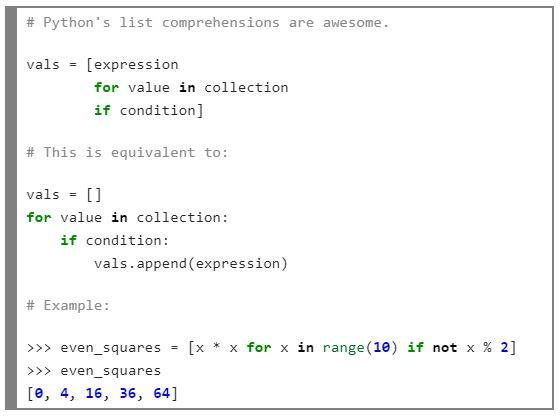
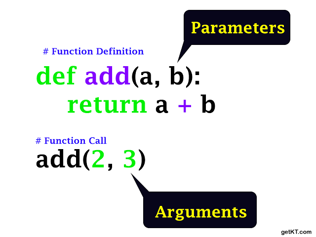
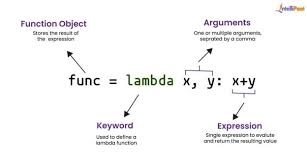
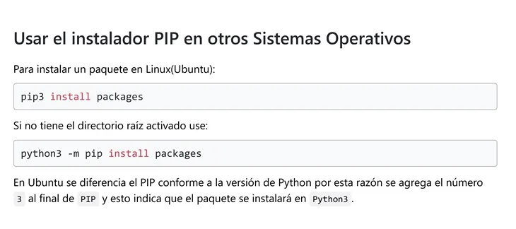

#  &nbsp;&nbsp;   **MANUAL DE PYTHON PARA NUEVOS DESARROLLADORES**

## **INDICE**

- Introducción
- 1.¿Qué es un condicional?
- 2.¿Cuáles son los diferentes tipos de bucles en Python? ¿Por qué son útiles?
- 3.¿Qué es una lista por comprensión en Python?
- 4.¿Qué es un argumento en Python?
- 5.¿Qué es una función Lambda en Python?
- 6.¿Qué es un paquete pip?
- Conclusión.
- Recursos adicionales

## **Introducción**
*¡Bienvenidos al equipo!*

Este manual está diseñado para ayudarte a entender conceptos fundamentales de Python de manera clara y práctica. Cada sección incluye explicaciones detalladas, ejemplos de código y consejos útiles.

## **1. ¿Qué es un condicional?**

Un condicional es una estructura de control que permite ejecutar diferentes bloques de código dependiendo de si una condición es verdadera (True) o falsa (False).
¿Para qué sirve?

- Tomar decisiones en tu código.
- Ejecutar diferentes acciones según condiciones específicas.
- Validar datos antes de procesarlos.

**Sintaxis:**

    if condicion:
        # Código si la condición es True
    elif otra_condicion:
        # Código si la condición anterior es False y esta es True
    else:
        # Código si ninguna condición es True

**Ejemplos practicos.**

>Ejemplo 1: Verificar si un número es positivo

    numero = 10

    if numero > 0:
        print("El número es positivo")
    elif numero < 0:
        print("El número es negativo")
    else:
        print("El número es cero")

    # Salida: El número es positivo

>Ejemplo 2: Verificar la edad para acceso

    edad = 18

    if edad >= 18:
        print("Puedes entrar")
    else:
        print("No puedes entrar, eres menor de edad")

    # Salida: Puedes entrar

>Ejemplo 3: Múltiples condiciones con AND/OR

    temperatura = 25
    esta_lloviendo = False

    if temperatura > 20 and not esta_lloviendo:
        print("¡Perfecto para salir!")
    elif temperatura <= 20:
        print("Hace frío, lleva abrigo")
    else:
        print("Está lloviendo, lleva paraguas")

    # Salida: ¡Perfecto para salir!

Para operar usan tanto operadores lógicos como de comparación

> Operadores comparación:

|Operador|Significado|Ejemplo|
|--------|----------|--------|
|==|Igual que|x == 5|
|!=|Diferente de|x != 5|
|<>|Diferente de (en desuso)|x <> 5|
|>|Mayor que|x > 5|
|<|Menor que|x < 5|
|>=|Mayor o igual que|x >= 5|
|<=|Menor o igual que|x <= 5|

> Operadores lógicos:

|Operador|Significado|Ejemplo|
|--------|----------|--------|
|and|Y lógico (ambos deben ser True)|x > 5 and x < 10|
|or|O lógico (al menos uno debe ser True)|x < 5 or x > 10|
|not|Negación (invierte el valor)|not x == 5|

Imagen:

 ### Consejos importantes

- Los bloques `if, elif y else` deben estar indentados (4 espacios o 1 tabulación).
- `elif` es opcional, puedes tener múltiples o ninguno.
- `else` es opcional, pero solo puede haber uno por bloque if
- Python evalúa las condiciones de arriba hacia abajo

----

## 2. ¿Cuáles son los diferentes tipos de bucles en Python? ¿Por qué son útiles?

Un bucle (o ciclo) es una estructura que repite un bloque de código múltiples veces hasta que se cumple una condición específica.
¿Por qué son útiles?

- Automatizar tareas repetitivas.
- Procesar colecciones de datos (listas, tuplas, diccionarios).
- Ejecutar código mientras se cumpla una condición.
- Reducir la cantidad de código duplicado.

### Tipo 1: Bucle `for`

Se usa cuanddo quieres repetir el código un número determinado de veces.

**Sintaxis:**

    for elemento in iterable:
        # Código a repetir

**Ejemplos prácticos:**

>Ejemplo 1: Recorrer una lista

    frutas = ["manzana", "banana", "naranja"]

    for fruta in frutas:
        print(f"Me gusta la {fruta}")

    # Salida:
    # Me gusta la manzana
    # Me gusta la banana
    # Me gusta la naranja

>Ejemplo 2: Usar range() para contar

    for i in range(5):
        print(f"Iteración {i}")

    # Salida:
    # Iteración 0
    # Iteración 1
    # Iteración 2
    # Iteración 3
    # Iteración 4

> Ejemplo 3: Recorrer un diccionario

    persona = {
        "nombre": "Ana",
        "edad": 30,
        "ciudad": "Madrid"
    }

    for clave, valor in persona.items():
        print(f"{clave}: {valor}")

    # Salida:
    # nombre: Ana
    # edad: 30
    # ciudad: Madrid

Función range()

|Uso|Descripción|Ejemplo|
|----|---|---|
|range(n)|De 0 a n-1|range(5) → 0, 1, 2, 3, 4|
|range(start, stop)|De start a stop-1|range(2, 6) → 2, 3, 4, 5|
|range(start, stop, step)|Con paso personalizado|range(0, 10, 2) → 0, 2, 4, 6, 8|

### Tipo 2: Bucle `while`

Se usa cuanddo quieres repetir el código un número indeterminado de veces, la repetición depende de una condición.

**Sintaxis básica**

    while condicion:
        # Código a repetir

**Ejemplos prácticos:**

>Ejemplo 1: Contador simple

    contador = 0

    while contador < 5:
        print(f"Contador: {contador}")
        contador += 1  # Importante: incrementar para evitar bucle infinito

    # Salida:
    # Contador: 0
    # Contador: 1
    # Contador: 2
    # Contador: 3
    # Contador: 4

>Ejemplo 2: Validación de entrada

    password_correcta = "python123"
    intentos = 3
    while intentos > 0:

        password = input("Ingresa la contraseña: ")
        
        if password == password_correcta:
            print("¡Acceso concedido!")
            break
        else:
            intentos -= 1
            print(f"Contraseña incorrecta. Te quedan {intentos} intentos.")

    if intentos == 0:
        print("Acceso denegado. Has agotado tus intentos.")

*Palabras clave útiles en bucles*

|Palabra clave|Función|Ejemplo|
|--|--|--|
|break|Sale del bucle inmediatamente|if x == 5: break|
|continue|Salta a la siguiente iteración|if x % 2 == 0: continue|
|else|Se ejecuta si el bucle termina normalmente (sin break)|for x in lista: ... else: ...|

>Ejemplo con break y continue

    # Ejemplo: Encontrar el primer número par
    numeros = [1, 3, 5, 8, 9, 10]

    for numero in numeros:
        if numero % 2 == 0:
            print(f"Primer número par encontrado: {numero}")
            break  # Sale del bucle
        else:
            print(f"{numero} es impar, continuando...")

    # Salida:
    # 1 es impar, continuando...
    # 3 es impar, continuando...
    # 5 es impar, continuando...
    # Primer número par encontrado: 8

*Comparación: for vs while*
|Característica|for|while|
|--|--|--|
|Uso principal|Iterar sobre colecciones|Repetir mientras condición sea True|
|Número de iteraciones|Conocido de antemano|Desconocido, depende de condición|
|Riesgo de bucle infinito|Bajo|Alto (si no actualizas la condición)|
|Ejemplo típico|Recorrer una lista|Esperar entrada del usuario|

Imagen:

**Consejos importantes**

- Evita bucles infinitos: Siempre asegúrate de que la condición del while pueda volverse False
- Usa for cuando puedas: Es más legible y menos propenso a errores
- Mantén los bucles cortos: Si un bucle es muy largo, considera extraer lógica a funciones
- Usa nombres descriptivos: for usuario in usuarios: es mejor que for u in us:

---

## 3. ¿Qué es una lista por comprensión en Python?

Una lista por comprensión (list comprehension) es una forma concisa y legible de crear listas aplicando una expresión a cada elemento de un iterable.
¿Para qué sirve?

- Crear listas de manera más compacta
- Transformar elementos de una lista existente
- Filtrar elementos según condiciones
- Mejorar la legibilidad del código

**Sintaxis básica**

    # Sintaxis general
    [nueva_expresion for elemento in iterable if condicion]

    # Sin condición
    [nueva_expresion for elemento in iterable]

**Ejemplos prácticos**
> Ejemplo 1: Crear una lista de cuadrados

    # Forma tradicional con bucle for
    numeros = [1, 2, 3, 4, 5]
    cuadrados = []

    for numero in numeros:
        cuadrados.append(numero ** 2)

    print(cuadrados)  # [1, 4, 9, 16, 25]

    # Forma con lista por comprensión
    cuadrados = [numero ** 2 for numero in numeros]
    print(cuadrados)  # [1, 4, 9, 16, 25]

> Ejemplo 2: Filtrar elementos

    # Obtener solo números pares
    numeros = [1, 2, 3, 4, 5, 6, 7, 8, 9, 10]

    # Forma tradicional
    pares = []
    for numero in numeros:
        if numero % 2 == 0:
            pares.append(numero)

    print(pares)  # [2, 4, 6, 8, 10]

    # Forma con lista por comprensión
    pares = [numero for numero in numeros if numero % 2 == 0]
    print(pares)  # [2, 4, 6, 8, 10]

> Ejemplo 3: Transformar y filtrar

    # Convertir a mayúsculas solo las palabras que empiezan con vocal
    palabras = ["hola", "amigo", "estas", "bien", "adios"]

    resultado = [palabra.upper() for palabra in palabras if palabra[0] in "aeiou"]
    print(resultado)  # ['AMIGO', 'ESTAS', 'ADIÓS']

Imagen:

 

*Consejos importantes*

- Legibilidad: Si la comprensión se vuelve demasiado compleja, usa un bucle for tradicional.
- No abuses: Para lógica muy compleja, un bucle tradicional puede ser más legible.
- Rendimiento: Las listas por comprensión suelen ser más rápidas que bucles for tradicionales.
- Solo para listas: Para otros iterables, usa generadores o comprensiones de conjuntos/diccionarios.

---

## 4. ¿Qué es un argumento en Python?

Un argumento es un valor que se pasa a una función cuando se la llama. Los argumentos permiten que las funciones reciban datos para procesar.
¿Para qué sirven?

- Hacer funciones reutilizables.
- Personalizar el comportamiento de una función.
- Separar datos de lógica.

Tipos de argumentos:

**1. Argumentos posicionales**

Los argumentos se pasan en el orden en que están definidos en la función.

    def saludar(nombre, edad):
        return f"Hola, soy {nombre} y tengo {edad} años"

    # Llamada con argumentos posicionales
    print(saludar("Ana", 30))  # Hola, soy Ana y tengo 30 años

 **2. Argumentos por nombre (keyword arguments)**

Se especifica el nombre del parámetro al llamar a la función.

    def saludar(nombre, edad):
        return f"Hola, soy {nombre} y tengo {edad} años"

    # Llamada con argumentos por nombre
    print(saludar(edad=30, nombre="Ana"))  # Hola, soy Ana y tengo 30 años

 **3. Argumentos con valores por defecto**

Si no se proporciona un valor, se usa el valor por defecto.

    def saludar(nombre, edad=25):
        return f"Hola, soy {nombre} y tengo {edad} años"

    # Con ambos argumentos
    print(saludar("Ana", 30))  # Hola, soy Ana y tengo 30 años

    # Solo con nombre (edad usa valor por defecto)
    print(saludar("Carlos"))   # Hola, soy Carlos y tengo 25 años

**4. Argumentos variables (*args)***

Permite pasar un número variable de argumentos posicionales.

    def suma(*numeros):
        total = 0
        for numero in numeros:
            total += numero
        return total

    print(suma(1, 2, 3))        # 6
    print(suma(1, 2, 3, 4, 5))  # 15

**5. Argumentos de palabra clave variables (**kwargs)****

    Permite pasar un número variable de argumentos con nombre.

    def imprimir_info(**datos):
        for clave, valor in datos.items():
            print(f"{clave}: {valor}")

    imprimir_info(nombre="Ana", edad=30, ciudad="Madrid")
    # nombre: Ana
    # edad: 30
    # ciudad: Madrid

**Combinación de tipos de argumentos**

    def funcion_compleja(obligatorio, *args, valor_por_defecto="default", **kwargs):
        print(f"Obligatorio: {obligatorio}")
        print(f"Args: {args}")
        print(f"Valor por defecto: {valor_por_defecto}")
        print(f"Kwargs: {kwargs}")

    funcion_compleja(1, 2, 3, 4, valor_por_defecto="custom", x=5, y=6)
    # Obligatorio: 1
    # Args: (2, 3, 4)
    # Valor por defecto: custom
    # Kwargs: {'x': 5, 'y': 6}

**Reglas de orden para argumentos**

    def funcion(arg_posicional, *args, arg_con_default=None, **kwargs):
        pass

|Orden|Tipo|
|--|--|
|1|Argumentos posicionales obligatorios|
|2|*args (argumentos posicionales variables)|
|3|Argumentos con valores por defecto|
|4|**kwargs (argumentos con nombre variables)|

Imagen:

 

*Consejos importantes*

- Usa argumentos por nombre para mejorar la legibilidad
- Documenta tus funciones con docstrings para explicar qué hace cada argumento
- Valida los argumentos si es necesario (tipo, rango, etc.)
- Evita demasiados argumentos: Si una función tiene más de 5-6 argumentos, considera usar un diccionario o un objeto

---

## 5. ¿Qué es una función Lambda en Python?

Una función lambda (también llamada función anónima) es una función pequeña y sin nombre que se define en una sola línea. Se usa principalmente para operaciones simples y temporales.
¿Para qué sirven?

- Operaciones simples y rápidas
- Funciones de callback
- Ordenar listas con criterios personalizados
- Filtrar y transformar datos

**Sintaxis**

    lambda argumentos: expresion

**Comparación: Función normal vs Lambda**

    #  Función normal
    def sumar(a, b):
        return a + b

    resultado = sumar(5, 3)  # 8

    #  Función lambda
    sumar = lambda a, b: a + b

    resultado = sumar(5, 3)  # 8

**Ejemplos prácticos**

> Ejemplo 1: Ordenar una lista de tuplas

    # Lista de estudiantes: (nombre, edad, nota)
    estudiantes = [
        ("Ana", 20, 8.5),
        ("Carlos", 22, 7.2),
        ("Beatriz", 21, 9.0),
        ("David", 19, 8.8)
    ]

    # Ordenar por edad
    estudiantes_por_edad = sorted(estudiantes, key=lambda estudiante: estudiante[1])
    print(estudiantes_por_edad)
    # [('David', 19, 8.8), ('Ana', 20, 8.5), ('Beatriz', 21, 9.0), ('Carlos', 22, 7.2)]

    # Ordenar por nota (descendente)
    estudiantes_por_nota = sorted(estudiantes, key=lambda estudiante: estudiante[2], reverse=True)
    print(estudiantes_por_nota)
    # [('Beatriz', 21, 9.0), ('David', 19, 8.8), ('Ana', 20, 8.5), ('Carlos', 22, 7.2)]

>Ejemplo 2: Filtrar con filter()

    numeros = [1, 2, 3, 4, 5, 6, 7, 8, 9, 10]

    # Obtener solo números pares
    pares = list(filter(lambda x: x % 2 == 0, numeros))
    print(pares)  # [2, 4, 6, 8, 10]

>Ejemplo 3: Transformar con `map()`

    numeros = [1, 2, 3, 4, 5]

    # Duplicar cada número
    duplicados = list(map(lambda x: x * 2, numeros))
    print(duplicados)  # [2, 4, 6, 8, 10]

Limitaciones de las funciones lambda

    # ❌ No puedes usar múltiples expresiones
    lambda x: x + 1, print(x)  # Error de sintaxis

    # ❌ No puedes usar declaraciones (if, for, while, etc.)
    lambda x: if x > 0: return x  # Error de sintaxis

    # ✅ Pero puedes usar expresiones ternarias
    lambda x: x if x > 0 else 0  # Válido

Cuándo usar lambda vs funciones normales
|Usa lambda cuando...|Usa función normal cuando...|
|--|--|
|La función es muy simple (una línea)|La función tiene múltiples líneas|
|La función es temporal/efímera|La función se reutilizará
|La función se pasa como argumento|Necesitas documentación (docstrings)|

Imagen:

 

*Consejos importantes*

- Mantén las lambdas simples: Si la lógica es compleja, usa una función normal
- Nombra tus lambdas si las usarás más de una vez: cuadrado = lambda x: x ** 2
- Prioriza la legibilidad: A veces una función normal es más clara que una lambda compleja
- Son especialmente útiles con `map(), filter(), sorted()` y callbacks.

---

## 6. ¿Qué es un paquete pip?

pip (Python Package Installer) es el sistema de gestión de paquetes estándar para Python. Permite instalar y administrar bibliotecas y dependencias adicionales que no están incluidas en la biblioteca estándar de Python.
¿Para qué sirve?

    Instalar paquetes/bibliotecas de terceros
    Administrar versiones de paquetes
    Desinstalar paquetes
    Listar paquetes instalados
    Actualizar paquetes

Comandos básicos de pip

**Instalar un paquete**

    # Instalar un paquete
    pip install nombre_del_paquete

    # Ejemplo: Instalar requests
    pip install requests

    # Instalar una versión específica
    pip install requests==2.28.0

    # Instalar la versión más reciente mayor o igual a una versión
    pip install requests>=2.28.0

**Desinstalar un paquete**

pip uninstall nombre_del_paquete

    # Ejemplo
    pip uninstall requests

**Listar paquetes instalados**

    # Listar todos los paquetes instalados
    pip list

    # Ver detalles de un paquete específico
    pip show requests

**Actualizar un paquete**

    # Actualizar un paquete a la última versión
    pip install --upgrade requests

    # Actualizar pip mismo
    pip install --upgrade pip

**Buscar paquetes**

    # Buscar paquetes en PyPI
    pip search nombre_a_buscar

**Archivo requirements.txt**

Es una práctica común mantener un archivo requirements.txt que liste todas las dependencias de un proyecto.

    # Generar requirements.txt desde paquetes instalados
    pip freeze > requirements.txt

    # Instalar todas las dependencias desde requirements.txt
    pip install -r requirements.txt

Ejemplo de requirements.txt:

    requests==2.28.0
    flask==2.2.2
    pandas==1.5.2
    numpy==1.23.5

**Repositorio principal: PyPI**

PyPI (Python Package Index) es el repositorio oficial de paquetes de Python. Contiene más de 400,000 paquetes disponibles para instalar con pip.

Sitio web: https://pypi.org/

*Paquetes populares*
|Paquete|Descripción|Comando de instalación|
|--|--|--|
|requests|HTTP para humanos|pip install requests|
|flask|Framework web ligero|pip install flask|
|django|Framework web completo|pip install django|
|pandas|Análisis de datos|pip install pandas|
|numpy|Computación numérica|pip install numpy|
|matplotlib|Visualización de datos|pip install matplotlib|
|beautifulsoup4|Web scraping|pip install beautifulsoup4|
|pytest|Testing|pip install pytest|

Imagen:

 

*Consejos importantes*

- Siempre usa entornos virtuales para proyectos diferentes
- Mantén tu requirements.txt actualizado
- Verifica las versiones de los paquetes en producción
- Lee la documentación de los paquetes antes de usarlos
- Revisa la licencia de los paquetes para uso comercial
- Mantén pip actualizado: pip install --upgrade pip

----
## Conclusión
¡Felicidades! Ahora tienes una comprensión sólida de conceptos fundamentales de Python. Recuerda:

- Practica regularmente: La mejor manera de aprender es escribiendo código
- Lee documentación: La documentación oficial es tu mejor amiga
- Pide ayuda: No dudes en preguntar a tus compañeros de equipo
- Explora proyectos reales: Mira código de otros desarrolladores en GitHub
- Sé paciente: El aprendizaje lleva tiempo, ¡no te rindas!

# Recursos adicionales

- Documentación oficial de Python: https://docs.python.org/3/
- Python Tutorial: https://docs.python.org/3/tutorial/
- Real Python: https://realpython.com/
- Python.org: https://www.python.org/
- PyPI: https://pypi.org/

