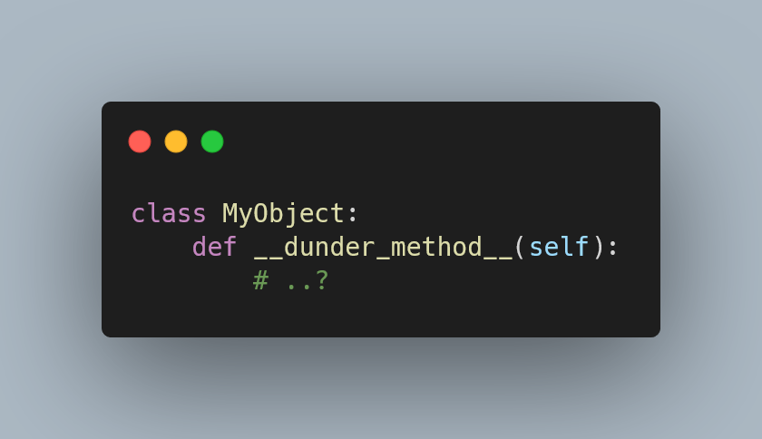

#   &nbsp;&nbsp;   MANUAL COMPLETO DE DESARROLLO PARA NUEVOS INTEGRANTES DEL EQUIPO

# Indice

- Introducción.
- ¿Para qué usamos Clases en Python?
- ¿Qué método se ejecuta automáticamente cuando se crea una instancia de una clase?
- ¿Cuáles son los tres verbos de API?
- ¿Es MongoDB una base de datos SQL o NoSQL?
- ¿Qué es una API?
- ¿Qué es Postman?
- ¿Qué es el polimorfismo?
- ¿Qué es un método dunder?
- ¿Qué es un decorador de python?
- Recursos adicionales

# Introducción

Este manual es tu guía definitiva para dominar los conceptos fundamentales del desarrollo moderno con Python. Está diseñado específicamente para personas que están comenzando su viaje en programación, con explicaciones paso a paso, ejemplos prácticos y consejos basados en la experiencia real del equipo.

*¿Qué aprenderás?*

- Programación Orientada a Objetos con Python
- APIs RESTful y comunicación entre sistemas
- Bases de datos SQL y NoSQL
- Patrones de diseño y buenas prácticas
- Herramientas profesionales como Postman

# 1. ¿Para qué usamos Clases en Python?

Una clase en Python es un molde, plantilla o receta para crear objetos. Piensa en ella como el plano arquitectónico de una casa: el plano define cómo será la casa, pero puedes construir muchas casas a partir del mismo plano.

Las clases permiten:

- Encapsular datos y comportamientos relacionados.
- Reutilizar código de manera eficiente.
- Modelar entidades del mundo real.
- Organizar código de forma lógica y mantenible.

**Analogía del mundo real**

    ┌─────────────────────────────────────────────────────┐
    │                  CLASE "Coche"                      │
    ├─────────────────────────────────────────────────────┤
    │  Atributos (características):                       │
    │  • marca: str                                       │
    │  • modelo: str                                      │
    │  • color: str                                       │
    │  • año: int                                         │
    │  • velocidad: int                                   │
    │                                                     │
    │  Métodos (comportamientos):                         │
    │  • arrancar() → None                                │
    │  • acelerar(km/h: int) → None                       │
    │  • frenar() → None                                  │
    │  • obtener_velocidad() → int                        │
    └─────────────────────────────────────────────────────┘
                              │
                              │ (Instanciar)
                              ▼
        ┌─────────────────────┼─────────────────────┐
        │                     │                     │
        ▼                     ▼                     ▼
    ┌─────────────┐    ┌─────────────┐    ┌─────────────┐
    │ OBJETO 1    │    │ OBJETO 2    │    │ OBJETO 3    │
    │ Coche       │    │ Coche       │    │ Coche       │
    ├─────────────┤    ├─────────────┤    ├─────────────┤
    │ marca:      │    │ marca:      │    │ marca:      │
    │ "Toyota"    │    │ "Ford"      │    │ "Tesla"     │
    │ modelo:     │    │ modelo:     │    │ modelo:     │
    │ "Corolla"   │    │ "Mustang"   │    │ "Model 3"   │
    │ color:      │    │ color:      │    │ color:      │
    │ "Rojo"      │    │ "Azul"      │    │ "Blanco"    │
    │ año: 2020   │    │ año: 2022   │    │ año: 2023   │
    │ velocidad:  │    │ velocidad:  │    │ velocidad:  │
    │ 0           │    │ 0           │    │ 0           │
    └─────────────┘    └─────────────┘    └─────────────┘

**Sintaxis completa con explicación**

    # Definición de una clase
    class NombreDeClase:
        """
        Docstring: Documentación de la clase
        Describe qué hace la clase y cómo usarla
        """
        
        # Atributo de clase (compartido por todas las instancias)
        atributo_clase = "Valor compartido"
        
        def __init__(self, parametro1, parametro2):
            """
            Constructor: se ejecuta automáticamente al crear una instancia
            Inicializa los atributos de cada objeto
            """
            # self: referencia al objeto actual
            self.atributo_instancia1 = parametro1
            self.atributo_instancia2 = parametro2
        
        def metodo_instancia(self):
            """
            Método de instancia: opera sobre un objeto específico
            Siempre recibe 'self' como primer parámetro
            """
            return f"Accediendo a {self.atributo_instancia1}"
        
        @classmethod
        def metodo_clase(cls):
            """
            Método de clase: opera sobre la clase, no sobre instancias
            Recibe 'cls' (referencia a la clase) como primer parámetro
            """
            return f"Método de clase de {cls.__name__}"
        
        @staticmethod
        def metodo_estatico():
            """
            Método estático: no depende de la clase ni de instancias
            No recibe 'self' ni 'cls'
            """
            return "Método estático (función dentro de una clase)"

> Ejemplo práctico completo: Sistema de gestión de biblioteca

    class Libro:
        """Representa un libro en la biblioteca"""
        
        # Atributo de clase: contador de todos los libros creados
        total_libros = 0
        
        def __init__(self, titulo, autor, isbn, anio_publicacion):
            """
            Constructor del libro
            
            Args:
                titulo (str): Título del libro
                autor (str): Nombre del autor
                isbn (str): ISBN del libro (identificador único)
                anio_publicacion (int): Año de publicación
            """
            # Atributos de instancia
            self.titulo = titulo
            self.autor = autor
            self.isbn = isbn
            self.anio_publicacion = anio_publicacion
            self.disponible = True
            self.prestado_a = None
            
            # Incrementar contador de clase
            Libro.total_libros += 1
        
        def prestar(self, nombre_persona):
            """Presta el libro a una persona"""
            if self.disponible:
                self.disponible = False
                self.prestado_a = nombre_persona
                print(f"✓ '{self.titulo}' prestado a {nombre_persona}")
                return True
            else:
                print(f"✗ '{self.titulo}' no está disponible")
                return False
        
        def devolver(self):
            """Devuelve el libro a la biblioteca"""
            if not self.disponible:
                print(f"✓ '{self.titulo}' devuelto por {self.prestado_a}")
                self.disponible = True
                self.prestado_a = None
                return True
            else:
                print(f"✗ '{self.titulo}' ya estaba disponible")
                return False
        
        def info(self):
            """Devuelve información formateada del libro"""
            estado = "Disponible" if self.disponible else f"Prestado a {self.prestado_a}"
            return f"'{self.titulo}' por {self.autor} ({self.anio_publicacion}) - {estado}"
        
        @classmethod
        def obtener_total_libros(cls):
            """Devuelve el total de libros creados"""
            return cls.total_libros
        
        @staticmethod
        def es_isbn_valido(isbn):
            """
            Valida si un ISBN tiene formato correcto
            ISBN-13: 13 dígitos, puede contener guiones
            """
            isbn_limpio = isbn.replace('-', '')
            return len(isbn_limpio) == 13 and isbn_limpio.isdigit()

    # ========== USO DEL SISTEMA ==========
    print("=" * 50)
    print("SISTEMA DE GESTIÓN DE BIBLIOTECA")
    print("=" * 50)

    # Crear libros (instancias de la clase)
    libro1 = Libro("Cien años de soledad", "Gabriel García Márquez", "978-3-16-148410-0", 1967)
    libro2 = Libro("1984", "George Orwell", "978-0-452-28423-4", 1949)
    libro3 = Libro("El Principito", "Antoine de Saint-Exupéry", "978-0-15-601219-5", 1943)

    # Mostrar información
    print("\n LIBROS EN LA BIBLIOTECA:")
    print(libro1.info())
    print(libro2.info())
    print(libro3.info())

    # Prestar libros
    print("\n PRESTAMOS:")
    libro1.prestar("Ana")
    libro2.prestar("Carlos")

    # Intentar prestar un libro ya prestado
    libro1.prestar("Beatriz")  # Debería fallar

    # Devolver libro
    print("\n  DEVOLUCIONES:")
    libro1.devolver()

    # Prestar de nuevo
    libro1.prestar("Beatriz")  # Ahora debería funcionar

    # Mostrar información actualizada
    print("\n ESTADO ACTUAL:")
    print(libro1.info())
    print(libro2.info())
    print(libro3.info())

    # Usar métodos de clase y estáticos
    print(f"\n Total de libros en el sistema: {Libro.obtener_total_libros()}")
    print(f" ISBN válido: {Libro.es_isbn_valido('978-3-16-148410-0')}")
    print(f" ISBN inválido: {Libro.es_isbn_valido('12345')}")

    # Salida esperada:
    # ==================================================
    # SISTEMA DE GESTIÓN DE BIBLIOTECA
    # ==================================================
    # 
    # LIBROS EN LA BIBLIOTECA:
    # 'Cien años de soledad' por Gabriel García Márquez (1967) - Disponible
    # '1984' por George Orwell (1949) - Disponible
    # 'El Principito' por Antoine de Saint-Exupéry (1943) - Disponible
    # 
    # PRESTAMOS:
    # ✓ 'Cien años de soledad' prestado a Ana
    # ✓ '1984' prestado a Carlos
    # ✗ 'Cien años de soledad' no está disponible
    # 
    # DEVOLUCIONES:
    # ✓ 'Cien años de soledad' devuelto por Ana
    # 
    # PRESTAMOS:
    # ✓ 'Cien años de soledad' prestado a Beatriz
    # 
    # ESTADO ACTUAL:
    # 'Cien años de soledad' por Gabriel García Márquez (1967) - Prestado a Beatriz
    # '1984' por George Orwell (1949) - Prestado a Carlos
    # 'El Principito' por Antoine de Saint-Exupéry (1943) - Disponible
    # 
    #  Total de libros en el sistema: 3
    #  ISBN válido: True
    #  ISBN inválido: False

**Comparación: Clases vs Funciones**
|Escenario|Usar Clases|Usar Funciones|
|--|--|--|
|Gestión de usuarios|Usuario con atributos y métodos|Funciones separadas para cada operación|
|Procesamiento de datos|Si no hay estado persistente|procesar_datos (datos)|
|Modelos de dominio|Producto, Pedido, Cliente| Difícil de mantener|
|Operaciones matemáticas|Sobrediseño|calcular_area(radio)|
|Configuración de aplicación|Configuracion con validación|Ambos funcionan|

*Buenas prácticas con clases*

- Nombres de clases: Usa PascalCase (ej: UsuarioAdmin)
- Nombres de métodos: Usa snake_case (ej: obtener_datos)
- Docstrings: Documenta siempre la clase y sus métodos
- Atributos privados: Usa _atributo para indicar "uso interno"
- Validación en `__init__`: Valida los datos al crear el objeto

# 2. ¿Qué método se ejecuta automáticamente cuando se crea una instancia de una clase?

El método __init__() (se pronuncia "dunder init") es el constructor de una clase. Se ejecuta automáticamente y exactamente una vez cada vez que creas una nueva instancia de una clase.

*¿Por qué se llama "dunder init"?*

- Dunder = Double UNDERscore.
- Los métodos que comienzan y terminan con doble guión bajo (__) son métodos especiales de Python.
- Python los llama automáticamente en situaciones específicas.

**Funcionamiento detallado**

    class Persona:
        def __init__(self, nombre, edad):
            print(f"(Constructor) Creando persona: {nombre}")
            self.nombre = nombre
            self.edad = edad
            self.saludar()
        
        def saludar(self):
            print(f"Hola, soy {self.nombre}")

    # Cuando ejecutas esta línea:
    persona1 = Persona("Ana", 30)

    # Python hace internamente:
    # 1. Crea un nuevo objeto vacío: persona1 = {}
    # 2. Llama automáticamente: Persona.__init__(persona1, "Ana", 30)
    # 3. Dentro de __init__, 'self' es el nuevo objeto 'persona1'
    # 4. Asigna atributos: persona1.nombre = "Ana", persona1.edad = 30
    # 5. Devuelve el objeto inicializado

>Ejemplo completo con múltiples métodos dunder

    class Punto:
        """Representa un punto en el plano cartesiano"""
        
        def __init__(self, x=0, y=0):
            """
            Constructor: inicializa las coordenadas del punto
            
            Args:
                x (int/float): Coordenada X. Por defecto 0.
                y (int/float): Coordenada Y. Por defecto 0.
            """
            print(f"Creando punto en ({x}, {y})")
            self.x = x
            self.y = y
        
        def __str__(self):
            """
            Se llama cuando usas print() o str()
            Devuelve una representación legible para humanos
            """
            return f"Punto({self.x}, {self.y})"
        
        def __repr__(self):
            """
            Se llama en la consola interactiva o con repr()
            Devuelve una representación para desarrolladores
            Debería poder recrear el objeto con eval()
            """
            return f"Punto({self.x}, {self.y})"
        
        def __add__(self, otro):
            """
            Sobrecarga del operador +
            Permite sumar dos puntos: punto1 + punto2
            """
            return Punto(self.x + otro.x, self.y + otro.y)
        
        def __eq__(self, otro):
            """
            Sobrecarga del operador ==
            Permite comparar dos puntos: punto1 == punto2
            """
            return self.x == otro.x and self.y == otro.y
        
        def __len__(self):
            """
            Se llama con len()
            Devuelve la distancia desde el origen (0, 0)
            """
            import math
            return int(math.sqrt(self.x**2 + self.y**2))
        
        def __getitem__(self, indice):
            """
            Se llama con punto[indice]
            Permite acceder como si fuera una lista: punto[0], punto[1]
            """
            if indice == 0:
                return self.x
            elif indice == 1:
                return self.y
            else:
                raise IndexError("Índice fuera de rango (0 o 1)")

    # ========== DEMOSTRACIÓN ==========
    print("=" * 50)
    print("DEMOSTRACIÓN DE MÉTODOS DUNDER")
    print("=" * 50)

    # __init__ se llama automáticamente al crear el objeto
    p1 = Punto(3, 4)  # Salida: Creando punto en (3, 4)
    p2 = Punto(1, 2)  # Salida: Creando punto en (1, 2)

    print("\n--- __str__ y __repr__ ---")
    print(p1)              # Punto(3, 4) ← llama a __str__
    print(repr(p1))        # Punto(3, 4) ← llama a __repr__

    print("\n--- __add__ (operador +) ---")
    p3 = p1 + p2          # Punto(4, 6) ← llama a __add__
    print(f"p1 + p2 = {p3}")

    print("\n--- __eq__ (operador ==) ---")
    p4 = Punto(3, 4)
    print(f"p1 == p4: {p1 == p4}")  # True ← llama a __eq__
    print(f"p1 == p2: {p1 == p2}")  # False

    print("\n--- __len__ ---")
    print(f"len(p1) = {len(p1)}")    # 5 ← llama a __len__
    print(f"len(p2) = {len(p2)}")    # 2

    print("\n--- __getitem__ (acceso con []) ---")
    print(f"p1[0] = {p1[0]}")        # 3 ← llama a __getitem__
    print(f"p1[1] = {p1[1]}")        # 4

    print("\n--- Uso en contextos reales ---")
    puntos = [p1, p2, p3]
    print(f"Lista de puntos: {puntos}")  # Usa __repr__ para cada punto

    if p1 in puntos:
        print(f"✓ p1 está en la lista")  # Usa __eq__ para comparar

    # Salida esperada:
    # ==================================================
    # DEMOSTRACIÓN DE MÉTODOS DUNDER
    # ==================================================
    # Creando punto en (3, 4)
    # Creando punto en (1, 2)
    # 
    # --- __str__ y __repr__ ---
    # Punto(3, 4)
    # Punto(3, 4)
    # 
    # --- __add__ (operador +) ---
    # p1 + p2 = Punto(4, 6)
    # 
    # --- __eq__ (operador ==) ---
    # p1 == p4: True
    # p1 == p2: False
    # 
    # --- __len__ ---
    # len(p1) = 5
    # len(p2) = 2
    # 
    # --- __getitem__ (acceso con []) ---
    # p1[0] = 3
    # p1[1] = 4
    # 
    # --- Uso en contextos reales ---
    # Lista de puntos: [Punto(3, 4), Punto(1, 2), Punto(4, 6)]
    # ✓ p1 está en la lista

**Errores comunes y cómo evitarlos**

    # ERROR 1: Olvidar 'self' como primer parámetro
    class Coche:
        def __init__(marca, modelo):  # ¡Falta self!
            self.marca = marca  # Error: self no está definido

        # CORRECTO
        class Coche:
            def __init__(self, marca, modelo):
                self.marca = marca
                self.modelo = modelo

    # ERROR 2: No llamar al __init__ de la clase padre en herencia
    class Vehiculo:
        def __init__(self, marca):
            self.marca = marca

    class Coche(Vehiculo):
        def __init__(self, marca, modelo):
            # Olvidamos llamar a super().__init__(marca)
            self.modelo = modelo  # marca no se inicializa

        # CORRECTO
        class Coche(Vehiculo):
            def __init__(self, marca, modelo):
                super().__init__(marca)  # Llama al constructor del padre
                self.modelo = modelo

    # ERROR 3: Retornar un valor en __init__
    class Persona:
        def __init__(self, nombre):
            self.nombre = nombre
            return self  # __init__ siempre debe retornar None

        # CORRECTO
        class Persona:
            def __init__(self, nombre):
                self.nombre = nombre
                # No hay return, o return None explícitamente

**Resumen de métodos dunder más importantes**
|Método|Se llama cuando...|Uso común|
|--|--|--|
|`__init__`(self, ...)|Se crea una instancia|Inicializar atributos|
|`__str__`(self)|print(obj) o str(obj)|Representación legible|
|`__repr__`(self)|repr(obj) o en consola|Representación para devs|
|`__len__(self)|len(obj)|Tamaño/longitud|
|`__getitem__`(self, key)|obj[key]|Acceso como diccionario/lista|
|`__setitem__|(self, key, val)|obj[key] = val|Asignación|
|`__call__`(self, ...)|obj(...)|Hacer objeto callable|
|`__add__`(self, other)|obj1 + obj2|Suma|
|`__eq__`(self, other)|obj1 == obj2|Igualdad|
|`__lt__`(self, other)|obj1 < obj2|Menor que|
|`__iter__`(self)|for x in obj|Iteración|
|`__enter__`(self)|with obj:|Context manager|
|`__exit__`(self, ...)|Salir de with|Context manager|

# 3. ¿Cuáles son los tres verbos de API?

En el desarrollo de APIs RESTful, los verbos HTTP (también llamados métodos HTTP) son las acciones que puedes realizar sobre los recursos. Aunque comúnmente se mencionan "tres verbos", en realidad hay cuatro fundamentales que cubren las operaciones CRUD (Create, Read, Update, Delete):

|Verbo HTTP|CRUD|Descripción|Idempotente|Seguro|
|--|--|--|--|--|
|GET|Read|Obtener/recuperar datos| Sí| Sí|
|POST|Create|Crear un nuevo recurso| No| No|
|PUT|Update|Reemplazar recurso completo|Sí| No|
|DELETE|Delete|Eliminar un recurso| Sí| No|

## Explicación detallada de cada verbo

**GET - Obtener datos**

Propósito: Recuperar información de un servidor sin modificar nada.
Características:

- Seguro: No cambia el estado del servidor
- Idempotente: Múltiples llamadas producen el mismo resultado
- Los parámetros van en la URL (query string)
- No debe tener efectos secundarios

> Ejemplo python

    import requests

    # Obtener todos los usuarios
    response = requests.get("https://api.example.com/users")
    usuarios = response.json()
    print(f"Total usuarios: {len(usuarios)}")

    # Obtener un usuario específico por ID
    response = requests.get("https://api.example.com/users/123")
    usuario = response.json()
    print(f"Nombre: {usuario['nombre']}")

    # Obtener con parámetros de búsqueda
    response = requests.get(
        "https://api.example.com/users",
        params={"rol": "admin", "activo": "true"}
    )
    admins = response.json()

> Ejemplo de URL con GET:

    GET https://api.example.com/users?rol=admin&pagina=1&limite=10

**POST - Crear recurso**
Propósito: Enviar datos al servidor para crear un nuevo recurso.
Características:

- No seguro: Cambia el estado del servidor (crea algo nuevo)
- No idempotente: Cada llamada crea un nuevo recurso
- Los datos van en el cuerpo (body) de la petición
- El servidor asigna el ID del nuevo recurso

> Ejemplo Python

    import requests

    # Crear un nuevo usuario
    nuevo_usuario = {
        "nombre": "Ana García",
        "email": "ana@example.com",
        "edad": 30
    }

    response = requests.post(
        "https://api.example.com/users",
        json=nuevo_usuario,
        headers={"Authorization": "Bearer token123"}
    )

    if response.status_code == 201:  # Created
        usuario_creado = response.json()
        print(f"✓ Usuario creado con ID: {usuario_creado['id']}")
    else:
        print(f"✗ Error: {response.status_code}")

    # Crear un post en un blog
    nuevo_post = {
        "titulo": "Mi primer post",
        "contenido": "Hola mundo!",
        "autor_id": 123
    }

    response = requests.post(
        "https://api.example.com/posts",
        json=nuevo_post
    )

> Ejemplo de flujo POST:

    Cliente: POST /users
    Body: {"nombre": "Ana", "email": "ana@test.com"}

    Servidor: HTTP 201 Created
    Location: /users/456
    Body: {"id": 456, "nombre": "Ana", "email": "ana@test.com"}

**PUT - Actualizar recurso completo**
Propósito: Reemplazar completamente un recurso existente.
Características:

- No seguro: Modifica el estado del servidor
- Idempotente: Múltiples llamadas con los mismos datos producen el mismo resultado
- Los datos completos van en el cuerpo
- Requiere especificar el ID del recurso a actualizar

> Ejemplo Python
>
    import requests

    # Actualizar completamente un usuario
    datos_actualizados = {
        "nombre": "Ana García López",  # Cambiado
        "email": "ana.garcia@example.com",  # Cambiado
        "edad": 31,  # Cambiado
        "telefono": "555-1234"  # Nuevo campo
    }

    response = requests.put(
        "https://api.example.com/users/123",
        json=datos_actualizados
    )

    if response.status_code == 200:
        print("✓ Usuario actualizado completamente")
        usuario = response.json()
        print(f"Nuevo nombre: {usuario['nombre']}")
    else:
        print(f"✗ Error: {response.status_code}")

    # IMPORTANTE: PUT reemplaza TODO el recurso
    # Si omites un campo, ¡se eliminará!
    response = requests.put(
        "https://api.example.com/users/123",
        json={"nombre": "Solo nombre"}  # ¡Email y edad se perderán!
    )

**DELETE - Eliminar recurso**
Propósito: Borrar un recurso del servidor.
Características:

- No seguro: Cambia el estado del servidor
- Idempotente: Eliminar algo ya eliminado no causa error
- Requiere especificar el ID del recurso
- Generalmente no lleva cuerpo (aunque HTTP lo permite)

> Ejemplo Python
>
    import requests

    # Eliminar un usuario
    response = requests.delete(
        "https://api.example.com/users/123",
        headers={"Authorization": "Bearer token123"}
    )

    if response.status_code == 204:  # No Content
        print("✓ Usuario eliminado correctamente")
    elif response.status_code == 404:
        print(" Usuario no encontrado")
    elif response.status_code == 403:
        print(" No tienes permisos para eliminar este usuario")
    else:
        print(f"✗ Error: {response.status_code}")

    # Eliminar un post
    response = requests.delete("https://api.example.com/posts/789")

**PUT vs PATCH - La diferencia crucial**
Además de los 4 verbos principales, existe PATCH, que es importante entender:

|Característica|PUT|PATCH|
|--|--|--|
|Propósito|Reemplazar TODO el recurso|Actualizar SOLO campos específicos
|Datos requeridos|Todos los campos (aunque no cambien)|Solo los campos a modificar
|Idempotente| Sí| Depende de la implementación|
|Ejemplo|PUT /users/123 con todos los datos|PATCH /users/123 con solo {"email": "nuevo@..."}|

>Ejemplo Python

    import requests

    # PUT: Reemplaza TODO el usuario
    response = requests.put(
        "https://api.example.com/users/123",
        json={
            "nombre": "Ana",
            "email": "ana@example.com",
            "edad": 30
        }
    )
    # Si omites "edad", ¡se elimina del usuario!

    # PATCH: Actualiza SOLO lo que envías
    response = requests.patch(
        "https://api.example.com/users/123",
        json={
            "email": "nuevo_email@example.com"  # Solo cambia el email
        }
    )
    # "nombre" y "edad" permanecen intactos

**Tabla comparativa completa**

|Verbo|CRUD|Idempotente|Seguro|Cuerpo|URL ejemplo|
|--|--|--|--|--|--|
|GET|Read|Sí|Sí|No|/users /users/123|
|POST|Create|No|No|Sí|/users|
|PUT|Update|Sí|No|Sí|/users/123|
|PATCH|Update|Opcional|No|Sí|/users/123
|DELETE|Delete|Sí|No|Opcional|/users/123|

Leyenda:

- Idempotente: Hacer la misma petición múltiples veces tiene el mismo efecto que hacerla una vez.
- Seguro: No modifica el estado del servidor.

> Ejemplo del mundo real: API de gestión de tareas
>
    import requests
    import json

    BASE_URL = "https://api.tareas.com/v1"

    class GestorTareas:
        def __init__(self, token):
            self.headers = {
                "Authorization": f"Bearer {token}",
                "Content-Type": "application/json"
            }
        
        def obtener_tareas(self, completadas=None):
            """GET - Obtener lista de tareas"""
            params = {}
            if completadas is not None:
                params["completadas"] = str(completadas).lower()
            
            response = requests.get(
                f"{BASE_URL}/tareas",
                headers=self.headers,
                params=params
            )
            
            if response.status_code == 200:
                return response.json()
            else:
                raise Exception(f"Error {response.status_code}: {response.text}")
        
        def crear_tarea(self, titulo, descripcion=""):
            """POST - Crear nueva tarea"""
            datos = {
                "titulo": titulo,
                "descripcion": descripcion,
                "completada": False
            }
            
            response = requests.post(
                f"{BASE_URL}/tareas",
                headers=self.headers,
                json=datos
            )
            
            if response.status_code == 201:
                return response.json()
            else:
                raise Exception(f"Error {response.status_code}: {response.text}")
        
        def actualizar_tarea(self, tarea_id, **datos):
            """PUT - Reemplazar tarea completa"""
            response = requests.put(
                f"{BASE_URL}/tareas/{tarea_id}",
                headers=self.headers,
                json=datos
            )
            
            if response.status_code == 200:
                return response.json()
            else:
                raise Exception(f"Error {response.status_code}: {response.text}")
        
        def modificar_tarea(self, tarea_id, **datos):
            """PATCH - Actualizar campos específicos"""
            response = requests.patch(
                f"{BASE_URL}/tareas/{tarea_id}",
                headers=self.headers,
                json=datos
            )
            
            if response.status_code == 200:
                return response.json()
            else:
                raise Exception(f"Error {response.status_code}: {response.text}")
        
        def eliminar_tarea(self, tarea_id):
            """DELETE - Eliminar tarea"""
            response = requests.delete(
                f"{BASE_URL}/tareas/{tarea_id}",
                headers=self.headers
            )
            
            if response.status_code == 204:
                return True
            else:
                raise Exception(f"Error {response.status_code}: {response.text}")

    # ========== USO ==========
    gestor = GestorTareas("mi_token_secreto")

    # GET: Obtener todas las tareas
    tareas = gestor.obtener_tareas()
    print(f"Tienes {len(tareas)} tareas")

    # POST: Crear nueva tarea
    nueva = gestor.crear_tarea(
        "Comprar leche",
        "Ir al supermercado después del trabajo"
    )
    print(f"Tarea creada con ID: {nueva['id']}")

    # PATCH: Marcar como completada
    gestor.modificar_tarea(nueva['id'], completada=True)
    print("✓ Tarea completada")

    # PUT: Reemplazar completamente
    gestor.actualizar_tarea(
        nueva['id'],
        titulo="Comprar leche y pan",
        descripcion="Ir al supermercado",
        completada=False
    )

    # DELETE: Eliminar tarea
    gestor.eliminar_tarea(nueva['id'])
    print("✓ Tarea eliminada")

# 4. ¿Es MongoDB una base de datos SQL o NoSQL?

MongoDB es una base de datos NoSQL orientada a documentos, lo que significa que:

- No usa tablas con filas y columnas como las bases de datos SQL tradicionales (MySQL, PostgreSQL, Oracle).
- Almacena datos en formato BSON (Binary JSON), que es similar a JSON pero más eficiente.
- No requiere un esquema fijo definido previamente.
- Es escalable horizontalmente mediante sharding (particionamiento de datos).

## Comparación detallada: SQL vs NoSQL

### Bases de datos SQL (Relacionales)
Las bases de datos SQL, también llamadas relacionales, siguen el modelo de datos relacional definido por Edgar F. Codd en 1970.

**Características principales:**
|Característica|Descripción|Ejemplo|
|--|--|--|
|Estructura|Tablas con filas y columnas|CREATE TABLE usuarios (...)|
|Esquema|Rígido, definido previamente|Todas las filas tienen las mismas columnas|
|Lenguaje|SQL (Structured Query Language)|SELECT * FROM usuarios WHERE edad > 18|
|Relaciones|JOINs entre tablas|INNER JOIN, LEFT JOIN|
|Transacciones|ACID garantizado|Atomicidad, Consistencia, Aislamiento, Durabilidad|
|Escalabilidad|Principalmente vertical|Mejor hardware (CPU, RAM, disco más rápido)|

> Ejemplo de base de datos SQL (PostgreSQL):
>
    -- 1. Definir el esquema (estructura de las tablas)
    CREATE TABLE usuarios (
        id SERIAL PRIMARY KEY,
        nombre VARCHAR(100) NOT NULL,
        email VARCHAR(100) UNIQUE NOT NULL,
        edad INTEGER CHECK (edad >= 0 AND edad <= 150),
        fecha_registro TIMESTAMP DEFAULT CURRENT_TIMESTAMP
    );

    CREATE TABLE posts (
        id SERIAL PRIMARY KEY,
        titulo VARCHAR(200) NOT NULL,
        contenido TEXT,
        autor_id INTEGER REFERENCES usuarios(id),
        fecha_publicacion TIMESTAMP DEFAULT CURRENT_TIMESTAMP
    );

    -- 2. Insertar datos
    INSERT INTO usuarios (nombre, email, edad) 
    VALUES ('Ana', 'ana@email.com', 30);

    INSERT INTO posts (titulo, contenido, autor_id)
    VALUES ('Mi primer post', 'Hola mundo!', 1);

    -- 3. Consultar con JOIN
    SELECT u.nombre, p.titulo, p.fecha_publicacion
    FROM usuarios u
    INNER JOIN posts p ON u.id = p.autor_id
    WHERE u.edad > 25
    ORDER BY p.fecha_publicacion DESC;

    -- 4. Actualizar datos
    UPDATE usuarios 
    SET email = 'ana.nueva@email.com'
    WHERE id = 1;

    -- 5. Eliminar datos
    DELETE FROM posts WHERE id = 1;

Ventajas de SQL:

- Integridad de datos: Restricciones (PRIMARY KEY, FOREIGN KEY, CHECK) garantizan datos válidos.
- Transacciones ACID: Operaciones complejas son atómicas y consistentes.
- Lenguaje estándar: SQL es universal y bien documentado.
- JOINs potentes: Consultas complejas cruzando múltiples tablas.
- Madurez: Décadas de desarrollo y optimización.

Desventajas de SQL:

- Esquema rígido: Cambiar estructura requiere migraciones complejas.
- Escalabilidad vertical limitada: Hardware tiene límites físicos.
- No ideal para datos jerárquicos: JSON anidado requiere múltiples tablas.
- Costo de licencias: Algunas opciones empresariales son caras.

## Bases de datos NoSQL (MongoDB)
Las bases de datos NoSQL (Not Only SQL) surgieron para abordar las limitaciones de las bases de datos relacionales en aplicaciones web modernas.

Características principales de MongoDB:
|Característica|Descripción|Beneficio|
|--|--|--|
|Estructura|Documentos BSON (similar a JSON)|Natural para aplicaciones modernas|
|Esquema|Flexible, schema-less|Evolución rápida sin migraciones|
|Lenguaje|Consultas en JSON-like|Fácil para desarrolladores JavaScript/Python|
|Relaciones|Documentos embebidos o referencias|Sin JOINs complejos|
|Transacciones|Soporte ACID desde v4.0|Ahora también tiene transacciones|
|Escalabilidad|Horizontal mediante sharding|Añadir más servidores fácilmente|

> Ejemplo de MongoDB
>
    // No hay definición de esquema previa
    // Simplemente insertas documentos

    // 2. Insertar datos
    db.usuarios.insertOne({
    nombre: "Ana",
    email: "ana@email.com",
    edad: 30,
    fecha_registro: new Date(),
    direccion: {
        calle: "Calle Principal 123",
        ciudad: "Madrid",
        pais: "España"
    },
    hobbies: ["leer", "correr", "viajar"],
    redes_sociales: {
        twitter: "@ana_tw",
        linkedin: "ana-linkedin"
    }
    });

    db.posts.insertOne({
    titulo: "Mi primer post",
    contenido: "Hola mundo!",
    autor: {
        id: ObjectId("..."),
        nombre: "Ana"
    },
    etiquetas: ["tecnología", "python"],
    comentarios: [
        {
        autor: "Carlos",
        texto: "¡Excelente post!",
        fecha: new Date()
        },
        {
        autor: "Beatriz",
        texto: "Gracias por compartir",
        fecha: new Date()
        }
    ],
    fecha_publicacion: new Date()
    });

    // 3. Consultar datos
    // Encontrar usuarios mayores de 25 años
    db.usuarios.find({ edad: { $gt: 25 } });

    // Encontrar posts con etiqueta "python"
    db.posts.find({ etiquetas: "python" });

    // Encontrar posts con más de 1 comentario
    db.posts.find({ "comentarios.1": { $exists: true } });

    // 4. Actualizar datos
    // Añadir un nuevo hobby a Ana
    db.usuarios.updateOne(
    { nombre: "Ana" },
    { $push: { hobbies: "cocinar" } }
    );

    // Actualizar email
    db.usuarios.updateOne(
    { nombre: "Ana" },
    { $set: { email: "ana.nueva@email.com" } }
    );

    // 5. Eliminar datos
    db.posts.deleteOne({ titulo: "Mi primer post" });

    // 6. Agregaciones complejas (similar a GROUP BY en SQL)
    db.posts.aggregate([
    { $unwind: "$etiquetas" },
    { $group: { _id: "$etiquetas", count: { $sum: 1 } } },
    { $sort: { count: -1 } }
    ]);
    // Resultado: [{ _id: "python", count: 5 }, { _id: "tecnología", count: 3 }, ...]

**Comparación visual: Mismo dato en SQL vs MongoDB**

Escenario: Usuario con perfil y publicaciones

*SQL (PostgreSQL):*

    -- Necesitas 3 tablas relacionadas
    CREATE TABLE usuarios (
        id SERIAL PRIMARY KEY,
        nombre VARCHAR(100),
        email VARCHAR(100)
    );

    CREATE TABLE perfiles (
        id SERIAL PRIMARY KEY,
        usuario_id INTEGER REFERENCES usuarios(id),
        biografia TEXT,
        ciudad VARCHAR(100)
    );

    CREATE TABLE posts (
        id SERIAL PRIMARY KEY,
        usuario_id INTEGER REFERENCES usuarios(id),
        titulo VARCHAR(200),
        contenido TEXT
    );

    -- Para obtener un usuario con su perfil y posts:
    SELECT 
        u.id, u.nombre, u.email,
        p.biografia, p.ciudad,
        po.titulo, po.contenido
    FROM usuarios u
    LEFT JOIN perfiles p ON u.id = p.usuario_id
    LEFT JOIN posts po ON u.id = po.usuario_id
    WHERE u.id = 1;

*MongoDB*

    // Un solo documento contiene todo
    db.usuarios.insertOne({
    _id: ObjectId("..."),
    nombre: "Ana",
    email: "ana@email.com",
    perfil: {
        biografia: "Desarrolladora Python",
        ciudad: "Madrid"
    },
    posts: [
        {
        titulo: "Mi primer post",
        contenido: "Hola mundo!"
        },
        {
        titulo: "Aprendiendo MongoDB",
        contenido: "Es muy flexible"
        }
    ]
    });

    // Para obtener todo:
    db.usuarios.findOne({ _id: ObjectId("...") });
    // ¡Todo viene en una sola consulta!

**¿Cuándo elegir MongoDB?**

*Casos ideales para MongoDB:*

- Aplicaciones con datos jerárquicos/anidados.
  - Redes sociales (usuarios → posts → comentarios → respuestas).
  - Catálogos de productos con variantes.
  - Configuraciones complejas
- Desarrollo ágil y prototipado rápido
  - No necesitas definir esquema antes de empezar
  - Puedes añadir campos nuevos sin migraciones
- Escalabilidad horizontal masiva
  - Aplicaciones con millones de usuarios
  - Big data y análisis en tiempo real
- Contenido variable por documento
  - Productos en e-commerce con atributos diferentes
  - Formularios dinámicos
- Aplicaciones modernas con JSON
  - APIs REST con JSON
  - Aplicaciones JavaScript (Node.js, React, Angular)

*Casos donde evitar MongoDB:*

- Sistemas que requieren transacciones complejas ACID
  - Sistemas bancarios
  - Contabilidad financiera
- Datos altamente relacionados con muchos JOINs
  - Sistemas ERP complejos
  - Data warehouses para BI
- Requisitos estrictos de consistencia inmediata
  - Sistemas de reservas (aunque MongoDB ha mejorado aquí)
- Equipos sin experiencia en NoSQL
  - Curva de aprendizaje diferente a SQL
  
**Arquitectura de MongoDB**

    ┌─────────────────────────────────────────────────┐
    │                   APLICACIÓN                    │
    │                     driver                      │
    └─────────────────────────────────────────────────┘
                            │
                            ▼
    ┌─────────────────────────────────────────────────┐
    │              MONGODB SERVER                     │
    │  ┌──────────────┐  ┌──────────────┐             │
    │  │  Database 1  │  │  Database 2  │             │
    │  │  (myapp)     │  │  (analytics) │             │
    │  └──────────────┘  └──────────────┘             │
    │         │                  │                    │
    │  ┌──────┴──────┐    ┌─────┴──────┐              │
    │  │  Collection │    │ Collection │              │
    │  │   (users)   │    │  (events)  │              │
    │  └──────┬──────┘    └─────┬──────┘              │
    │         │                  │                    │
    │  ┌──────┴──────────────────┴──────┐             │
    │  │      Documents (BSON)          │             │
    │  │  { _id: ..., nombre: "Ana" }   │             │
    │  │  { _id: ..., nombre: "Carlos"} │             │
    │  └────────────────────────────────┘             │
    └─────────────────────────────────────────────────┘
                            │
                            ▼
    ┌─────────────────────────────────────────────────┐
    │              ALMACENAMIENTO                     │
    │           (WiredTiger Storage Engine)           │
    └─────────────────────────────────────────────────┘

MongoDB en la industria

Empresas que usan MongoDB:

- Adobe: Para Adobe Experience Platform.
- eBay: Catálogo de productos.
- Facebook: Almacenamiento de mensajes.
- Google: Google Cloud MongoDB Atlas.
- LinkedIn: Gestión de perfiles.
- Twitter: Almacenamiento de tweets (en parte).
- Uber: Sistema de geolocalización.

Casos de uso reales:

- E-commerce: Catálogos con productos de diferentes categorías y atributos variables.
- IoT: Almacenamiento de datos de sensores con diferentes formatos.
- Redes sociales: Publicaciones con comentarios anidados, likes, compartidos.
- Analytics: Eventos de usuario con datos variables.
- CMS: Contenido con estructuras flexibles.

# 5. ¿Qué es una API?

API (Application Programming Interface) es un contrato de comunicación entre diferentes sistemas de software. Es como un menú de restaurante: te muestra qué opciones tienes sin revelar cómo se prepara cada plato en la cocina.

**Analogía del restaurante**

    ┌─────────────────────────────────────────────────────────┐
    │                    RESTAURANTE                          │
    │                                                         │
    │  ┌─────────────────┐    ┌──────────────────┐            │
    │  │   MENÚ (API)    │    │   COCINA         │            │
    │  │                 │    │   (Backend)      │            │
    │  │ • Pizza         │    │                  │            │
    │  │ • Pasta         │    │   Ingredientes   │            │
    │  │ • Ensalada      │    │   Recetas        │            │
    │  │ • Postre        │    │   Utensilios     │            │
    │  └────────┬────────┘    └──────────────────┘            │
    │           │                                             │
    │           ▼                                             │
    │  ┌─────────────────┐                                    │
    │  │   CAMARERO      │                                    │
    │  │   (Protocolo)   │                                    │
    │  └─────────────────┘                                    │
    └─────────────────────────────────────────────────────────┘
                │
                ▼
    ┌─────────────────────────────────────────────────────────┐
    │              CLIENTE (Tu aplicación)                    │
    │                                                         │
    │  "Quiero una pizza margherita"                          │
    │  (Petición HTTP GET /menu/pizza)                        │
    │                                                         │
    │  ← "Aquí tienes tu pizza"                               │
    │  (Respuesta HTTP 200 + JSON con datos)                  │
    └─────────────────────────────────────────────────────────┘

¿Qué hace una API exactamente?
Una API define:

- Qué puedes solicitar (endpoints/recursos)
- Cómo hacer la solicitud (métodos HTTP, headers, parámetros)
- Qué recibirás como respuesta (formato, estructura de datos)
- Qué puede salir mal (códigos de error, mensajes)

## Tipos de APIs

**REST API (Representational State Transfer)**

El estándar más popular para APIs web modernas.

Características principales:

- Basada en HTTP/HTTPS
- Usa verbos HTTP (GET, POST, PUT, DELETE)
- Stateless (cada petición contiene toda la información necesaria)
- Formato de datos: JSON (más común), XML, o ambos
- Recursos identificados por URLs

>Ejemplo Python de REST API:

    import requests
    import json

    # API pública de JSONPlaceholder (para pruebas)
    BASE_URL = "https://jsonplaceholder.typicode.com"

    # 1. GET - Obtener todos los posts
    response = requests.get(f"{BASE_URL}/posts")
    posts = response.json()
    print(f"Total posts: {len(posts)}")
    print(f"Primer post: {posts[0]['title']}")

    # 2. GET - Obtener un post específico por ID
    response = requests.get(f"{BASE_URL}/posts/1")
    post = response.json()
    print(f"\nPost ID 1:")
    print(f"  Título: {post['title']}")
    print(f"  Cuerpo: {post['body'][:100]}...")

    # 3. POST - Crear un nuevo post
    nuevo_post = {
        "userId": 1,
        "title": "Mi primer post con API",
        "body": "Este es el contenido del post"
    }

    response = requests.post(f"{BASE_URL}/posts", json=nuevo_post)
    if response.status_code == 201:  # Created
        post_creado = response.json()
        print(f"\n✓ Post creado con ID: {post_creado['id']}")

    # 4. PUT - Actualizar un post completo
    datos_actualizados = {
        "userId": 1,
        "title": "Post actualizado",
        "body": "Contenido modificado"
    }

    response = requests.put(f"{BASE_URL}/posts/1", json=datos_actualizados)
    if response.status_code == 200:
        print(f"\n✓ Post actualizado")

    # 5. PATCH - Actualizar solo algunos campos
    response = requests.patch(
        f"{BASE_URL}/posts/1",
        json={"title": "Solo cambio el título"}
    )
    if response.status_code == 200:
        print(f"\n✓ Título actualizado")

    # 6. DELETE - Eliminar un post
    response = requests.delete(f"{BASE_URL}/posts/1")
    if response.status_code == 200:
        print(f"\n✓ Post eliminado")

    # 7. GET con parámetros de consulta
    response = requests.get(
        f"{BASE_URL}/posts",
        params={"userId": 1, "_limit": 3}
    )
    posts_usuario_1 = response.json()
    print(f"\nPosts del usuario 1 (limitados a 3):")
    for p in posts_usuario_1:
        print(f"  • {p['title']}")

**GraphQL**

Alternativa moderna a REST que permite consultas más flexibles.

Características:

- Cliente decide qué datos necesita
- Una sola petición puede obtener datos de múltiples recursos
- Tipado fuerte y autodocumentación
- Evita el problema de "overfetching" (traer datos innecesarios)

Ejemplo Python con GraphQL:

    import requests

    # API GraphQL pública
    url = "https://graphql.anilist.co"

    # Query: Solicitar datos específicos
    query = """
    query ($page: Int) {
    Page(page: $page, perPage: 10) {
        media(type: ANIME, sort: POPULARITY_DESC) {
        id
        title {
            romaji
            english
        }
        episodes
        popularity
        }
    }
    }
    """

    variables = {"page": 1}

    response = requests.post(
        url,
        json={'query': query, 'variables': variables}
    )

    data = response.json()
    animes = data['data']['Page']['media']

    print("Top 10 animes populares:")
    for i, anime in enumerate(animes, 1):
        print(f"{i}. {anime['title']['english'] or anime['title']['romaji']}")
        print(f"   Episodios: {anime['episodes']}, Popularidad: {anime['popularity']}")

**SOAP (Simple Object Access Protocol)**

Protocolo más antiguo y verboso, aún usado en sistemas empresariales legacy.

Características:

- Basado en XML (más pesado que JSON)
- Requiere WSDL (Web Services Description Language)
- Transacciones ACID garantizadas
- Seguridad integrada (WS-Security)

Ejemplo XML SOAP (conceptual):

    <!-- Petición SOAP -->
    <soap:Envelope xmlns:soap="http://www.w3.org/2003/05/soap-envelope">
    <soap:Header>
        <AuthHeader>
        <Username>usuario</Username>
        <Password>contraseña</Password>
        </AuthHeader>
    </soap:Header>
    <soap:Body>
        <GetUserDetails xmlns="http://example.com/api">
        <UserId>123</UserId>
        </GetUserDetails>
    </soap:Body>
    </soap:Envelope>

    <!-- Respuesta SOAP -->
    <soap:Envelope xmlns:soap="http://www.w3.org/2003/05/soap-envelope">
    <soap:Body>
        <GetUserDetailsResponse xmlns="http://example.com/api">
        <User>
            <Name>Ana García</Name>
            <Email>ana@example.com</Email>
            <Age>30</Age>
        </User>
        </GetUserDetailsResponse>
    </soap:Body>
    </soap:Envelope>

*Arquitectura típica de una API REST*

    ┌─────────────────────────────────────────────────────────┐
    │                  CLIENTE (Frontend)                     │
    │              React, Angular, Vue, iOS, Android          │
    └─────────────────────────────────────────────────────────┘
                            │
                            ▼
    ┌─────────────────────────────────────────────────────────┐
    │                  INTERNET (HTTP/HTTPS)                  │
    └─────────────────────────────────────────────────────────┘
                            │
                            ▼
    ┌─────────────────────────────────────────────────────────┐
    │              SERVIDOR WEB (Nginx, Apache)               │
    │              - Balanceo de carga                        │
    │              - SSL/TLS termination                      │
    └─────────────────────────────────────────────────────────┘
                            │
                            ▼
    ┌─────────────────────────────────────────────────────────┐
    │              API GATEWAY / MIDDLEWARE                   │
    │              - Autenticación                            │
    │              - Rate limiting                            │
    │              - Logging                                  │
    │              - Caching                                  │
    └─────────────────────────────────────────────────────────┘
                            │
                            ▼
    ┌─────────────────────────────────────────────────────────┐
    │              APLICACIÓN (Backend)                       │
    │              Flask, Django, FastAPI, Node.js            │
    │                                                         │
    │  ┌──────────┐  ┌──────────┐  ┌──────────┐               │
    │  │  Users   │  │  Posts   │  │  Auth    │               │
    │  │  API     │  │  API     │  │  API     │               │
    │  └──────────┘  └──────────┘  └──────────┘               │
    └─────────────────────────────────────────────────────────┘
                            │
                            ▼
    ┌─────────────────────────────────────────────────────────┐
    │              BASE DE DATOS                              │
    │              PostgreSQL, MongoDB, Redis                 │
    └─────────────────────────────────────────────────────────┘

> Ejemplo práctico completo con Python: API REST con Flask
>
    from flask import Flask, jsonify, request, abort
    from datetime import datetime

    app = Flask(__name__)

    # Base de datos en memoria (en producción usarías PostgreSQL/MongoDB)
    usuarios_db = [
        {"id": 1, "nombre": "Ana", "email": "ana@email.com", "edad": 30},
        {"id": 2, "nombre": "Carlos", "email": "carlos@email.com", "edad": 25},
        {"id": 3, "nombre": "Beatriz", "email": "beatriz@email.com", "edad": 28}
    ]

    # Contador para nuevos IDs
    next_id = 4

    # ========================================
    # ENDPOINTS DE LA API
    # ========================================

    @app.route('/api/usuarios', methods=['GET'])
    def obtener_usuarios():
        """
        GET /api/usuarios
        Obtiene todos los usuarios o filtra por parámetros
        
        Query params:
        - edad_min: edad mínima
        - edad_max: edad máxima
        - nombre: buscar por nombre (case-insensitive)
        
        Ejemplo: /api/usuarios?edad_min=25&edad_max=30
        """
        # Obtener parámetros de consulta
        edad_min = request.args.get('edad_min', type=int)
        edad_max = request.args.get('edad_max', type=int)
        nombre = request.args.get('nombre', type=str)
        
        # Filtrar usuarios
        resultado = usuarios_db
        
        if edad_min is not None:
            resultado = [u for u in resultado if u['edad'] >= edad_min]
        
        if edad_max is not None:
            resultado = [u for u in resultado if u['edad'] <= edad_max]
        
        if nombre is not None:
            resultado = [u for u in resultado 
                        if nombre.lower() in u['nombre'].lower()]
        
        return jsonify({
            "total": len(resultado),
            "usuarios": resultado
        }), 200

    @app.route('/api/usuarios/<int:usuario_id>', methods=['GET'])
    def obtener_usuario(usuario_id):
        """
        GET /api/usuarios/<id>
        Obtiene un usuario específico por su ID
        """
        usuario = next((u for u in usuarios_db if u['id'] == usuario_id), None)
        
        if usuario is None:
            abort(404, description="Usuario no encontrado")
        
        return jsonify(usuario), 200

    @app.route('/api/usuarios', methods=['POST'])
    def crear_usuario():
        """
        POST /api/usuarios
        Crea un nuevo usuario
        
        Body (JSON):
        {
            "nombre": "Nuevo Usuario",
            "email": "nuevo@email.com",
            "edad": 25
        }
        """
        # Validar que el cuerpo sea JSON
        if not request.json:
            abort(400, description="El cuerpo debe ser JSON")
        
        # Validar campos requeridos
        if 'nombre' not in request.json or 'email' not in request.json:
            abort(400, description="Faltan campos requeridos: nombre, email")
        
        # Validar email único
        email = request.json['email']
        if any(u['email'] == email for u in usuarios_db):
            abort(409, description=f"Email {email} ya existe")
        
        # Crear nuevo usuario
        global next_id
        nuevo_usuario = {
            "id": next_id,
            "nombre": request.json['nombre'],
            "email": email,
            "edad": request.json.get('edad', 0),
            "fecha_creacion": datetime.now().isoformat()
        }
        
        usuarios_db.append(nuevo_usuario)
        next_id += 1
        
        return jsonify(nuevo_usuario), 201  # Created

    @app.route('/api/usuarios/<int:usuario_id>', methods=['PUT'])
    def actualizar_usuario(usuario_id):
        """
        PUT /api/usuarios/<id>
        Actualiza completamente un usuario
        
        Body (JSON):
        {
            "nombre": "Nombre Actualizado",
            "email": "actualizado@email.com",
            "edad": 31
        }
        """
        # Encontrar usuario
        usuario = next((u for u in usuarios_db if u['id'] == usuario_id), None)
        
        if usuario is None:
            abort(404, description="Usuario no encontrado")
        
        # Validar cuerpo
        if not request.json:
            abort(400, description="El cuerpo debe ser JSON")
        
        # Actualizar todos los campos
        usuario['nombre'] = request.json.get('nombre', usuario['nombre'])
        usuario['email'] = request.json.get('email', usuario['email'])
        usuario['edad'] = request.json.get('edad', usuario['edad'])
        
        return jsonify(usuario), 200

    @app.route('/api/usuarios/<int:usuario_id>', methods=['PATCH'])
    def modificar_usuario(usuario_id):
        """
        PATCH /api/usuarios/<id>
        Actualiza campos específicos de un usuario
        """
        # Encontrar usuario
        usuario = next((u for u in usuarios_db if u['id'] == usuario_id), None)
        
        if usuario is None:
            abort(404, description="Usuario no encontrado")
        
        # Validar cuerpo
        if not request.json:
            abort(400, description="El cuerpo debe ser JSON")
        
        # Actualizar solo los campos enviados
        for campo in ['nombre', 'email', 'edad']:
            if campo in request.json:
                usuario[campo] = request.json[campo]
        
        return jsonify(usuario), 200

    @app.route('/api/usuarios/<int:usuario_id>', methods=['DELETE'])
    def eliminar_usuario(usuario_id):
        """
        DELETE /api/usuarios/<id>
        Elimina un usuario
        """
        global usuarios_db
        
        # Encontrar índice del usuario
        indice = next((i for i, u in enumerate(usuarios_db) 
                    if u['id'] == usuario_id), None)
        
        if indice is None:
            abort(404, description="Usuario no encontrado")
        
        # Eliminar usuario
        usuario_eliminado = usuarios_db.pop(indice)
        
        return jsonify({
            "mensaje": f"Usuario {usuario_eliminado['nombre']} eliminado",
            "usuario": usuario_eliminado
        }), 200

    # ========================================
    # MANEJO DE ERRORES
    # ========================================

    @app.errorhandler(404)
    def not_found(error):
        return jsonify({"error": str(error)}), 404

    @app.errorhandler(400)
    def bad_request(error):
        return jsonify({"error": str(error)}), 400

    @app.errorhandler(409)
    def conflict(error):
        return jsonify({"error": str(error)}), 409

    @app.errorhandler(500)
    def internal_error(error):
        return jsonify({"error": "Error interno del servidor"}), 500

    # ========================================
    # PUNTO DE ENTRADA
    # ========================================

    if __name__ == '__main__':
        print("=" * 60)
        print("API REST - Gestión de Usuarios")
        print("=" * 60)
        print("\nEndpoints disponibles:")
        print("  GET    /api/usuarios          - Listar todos los usuarios")
        print("  GET    /api/usuarios/<id>     - Obtener usuario por ID")
        print("  POST   /api/usuarios          - Crear nuevo usuario")
        print("  PUT    /api/usuarios/<id>     - Actualizar usuario completo")
        print("  PATCH  /api/usuarios/<id>     - Actualizar campos específicos")
        print("  DELETE /api/usuarios/<id>     - Eliminar usuario")
        print("\nIniciando servidor en http://localhost:5000")
        print("=" * 60)
        
        app.run(debug=True, port=5000)

> Probando la API con Python
>
    import requests
    import json

    BASE_URL = "http://localhost:5000/api"

    def imprimir_respuesta(response):
        """Helper para imprimir respuestas formateadas"""
        print(f"\n{'='*50}")
        print(f"Status Code: {response.status_code}")
        print(f"{'='*50}")
        try:
            print(json.dumps(response.json(), indent=2))
        except:
            print(response.text)
        print()

    # 1. Obtener todos los usuarios
    print("1. GET /api/usuarios")
    response = requests.get(f"{BASE_URL}/usuarios")
    imprimir_respuesta(response)

    # 2. Filtrar por edad
    print("2. GET /api/usuarios?edad_min=25&edad_max=30")
    response = requests.get(
        f"{BASE_URL}/usuarios",
        params={"edad_min": 25, "edad_max": 30}
    )
    imprimir_respuesta(response)

    # 3. Obtener usuario específico
    print("3. GET /api/usuarios/1")
    response = requests.get(f"{BASE_URL}/usuarios/1")
    imprimir_respuesta(response)

    # 4. Crear nuevo usuario
    print("4. POST /api/usuarios")
    nuevo_usuario = {
        "nombre": "David",
        "email": "david@email.com",
        "edad": 35
    }
    response = requests.post(f"{BASE_URL}/usuarios", json=nuevo_usuario)
    imprimir_respuesta(response)

    # 5. Actualizar usuario (PUT)
    print("5. PUT /api/usuarios/1")
    datos_actualizados = {
        "nombre": "Ana García",
        "email": "ana.garcia@email.com",
        "edad": 31
    }
    response = requests.put(f"{BASE_URL}/usuarios/1", json=datos_actualizados)
    imprimir_respuesta(response)

    # 6. Modificar usuario (PATCH)
    print("6. PATCH /api/usuarios/2")
    response = requests.patch(
        f"{BASE_URL}/usuarios/2",
        json={"edad": 26}
    )
    imprimir_respuesta(response)

    # 7. Eliminar usuario
    print("7. DELETE /api/usuarios/3")
    response = requests.delete(f"{BASE_URL}/usuarios/3")
    imprimir_respuesta(response)

    # 8. Verificar que se eliminó
    print("8. GET /api/usuarios (después de eliminar)")
    response = requests.get(f"{BASE_URL}/usuarios")
    imprimir_respuesta(response)

Códigos de estado HTTP comunes
|Código|Nombre|Descripción|
|--|--|--|
|200|OK|La petición fue exitosa|
|201|Created|Recurso creado exitosamente|
|204|No Content|Éxito, pero sin contenido en la respuesta|
|400|Bad Request|Petición mal formada|
|401|Unauthorized|No autenticado (necesita login)|
|403|Forbidden|Autenticado pero sin permisos|
|404|Not Found|Recurso no encontrado|
|409|Conflict|Conflicto (ej: email ya existe)|
|422|Unprocessable Entity|Datos válidos pero semánticamente incorrectos|
|429|Too Many Requests|Demasiadas peticiones (rate limit)|
|500|Internal Server Error|Error en el servidor|

## Autenticación en APIs

1. API Key
   
        import requests

        headers = {
            "X-API-Key": "tu_api_key_secreta"
        }

        response = requests.get(
            "https://api.ejemplo.com/datos",
            headers=headers
        )
2. Bearer Token (JWT)

        import requests

        # 1. Obtener token
        login_data = {
            "username": "usuario",
            "password": "contraseña"
        }

        response = requests.post("https://api.ejemplo.com/auth/login", json=login_data)
        token = response.json()['access_token']

        # 2. Usar token en peticiones
        headers = {
            "Authorization": f"Bearer {token}"
        }

        response = requests.get(
            "https://api.ejemplo.com/usuarios",
            headers=headers
        )

3. OAuth 2.0

        import requests
        from requests_oauthlib import OAuth2Session

        # Configuración OAuth
        client_id = "tu_client_id"
        client_secret = "tu_client_secret"
        authorization_base_url = "https://api.ejemplo.com/oauth/authorize"
        token_url = "https://api.ejemplo.com/oauth/token"

        # Crear sesión OAuth
        oauth = OAuth2Session(client_id, redirect_uri="http://localhost:8000/callback")

        # Obtener URL de autorización
        authorization_url, state = oauth.authorization_url(authorization_base_url)
        print(f"Visita esta URL para autorizar: {authorization_url}")

        # Después de autorización, obtener token
        redirect_response = input("Pega la URL completa después de autorizar: ")
        token = oauth.fetch_token(
            token_url,
            authorization_response=redirect_response,
            client_secret=client_secret
        )

        # Usar API protegida
        response = oauth.get("https://api.ejemplo.com/usuarios")
        print(response.json())

**Conclusión**

Las APIs son el pegamento del mundo digital moderno. Permiten que diferentes sistemas, lenguajes y plataformas se comuniquen entre sí de manera estandarizada.

# 6. ¿Qué es Postman?

Postman es una plataforma de colaboración para el desarrollo de APIs que permite diseñar, probar, documentar y monitorear APIs de manera visual e intuitiva, sin necesidad de escribir código.

¿Por qué es esencial para desarrolladores?

Postman es como un "laboratorio de pruebas" para APIs. Imagina que estás construyendo un coche: antes de entregarlo al cliente, lo pruebas en un circuito de pruebas. Postman es ese circuito para tus APIs.

**Características principales**

- Builder visual de peticiones.
- Organiza tus endpoints en colecciones temáticas.
- Gestiona diferentes configuraciones para desarrollo, staging y producción.
- Escribe scripts para validar automáticamente las respuestas.
- Ejecuta colecciones automáticamente en intervalos programados.

**Alternativas a Postman**

|Herramienta|Tipo|Ventajas|Desventajas|
|--|--|--|--|
|Postman|Desktop/Web|Completo, colaborativo, popular|Puede ser lento, versión gratuita limitada|
|Thunder Client|VS Code Extension|Integrado en VS Code, rápido|Menos funcionalidades|
|Insomnia|Desktop|Open source, limpia interfaz|Menos popular, menos plugins|
|curl|CLI|Ligero, scriptable|Sin interfaz visual|
|HTTPie|CLI|Más legible que curl|Requiere instalación|
|Bruno|Desktop|Archivos locales (no cloud)|Nuevo, menos maduro|

**Consejos profesionales**
- Organiza tus colecciones por dominio.
- Usa pre-request scripts para setup automático.
- Exporta colecciones para compartir con el equipo.
- Usa data-driven testing.
- Configura Newman para CI/CD.

**Conclusión**

Postman es una herramienta indispensable en el toolkit moderno de desarrollo. Permite:
- Probar APIs rápidamente sin escribir código.
- Documentar APIs de forma profesional y automática.
- Automatizar tests para CI/CD.
- Colaborar con equipos de desarrollo.
- Mockear APIs para desarrollo paralelo.

# 7. ¿Qué es el polimorfismo?

Polimorfismo (del griego poly = "muchos" + morphē = "formas") es uno de los cuatro pilares fundamentales de la Programación Orientada a Objetos (junto con encapsulación, herencia y abstracción).

El polimorfismo permite que objetos de diferentes clases respondan al mismo mensaje (método) de maneras diferentes y específicas para cada clase.

Analogía del mundo real. Imagina que le dices a diferentes personas "Saluda":

    ┌─────────────┐      "Saluda"      ┌──────────────┐
    │   Persona   │ ─────────────────> │  "Hola"      │
    │   Española  │                    │  (en español)│
    └─────────────┘                    └──────────────┘

    ┌─────────────┐      "Saluda"      ┌──────────────┐
    │   Persona   │ ─────────────────> │  "Hello"     │
    │   Inglesa   │                    │  (en inglés) │
    └─────────────┘                    └──────────────┘

    ┌─────────────┐      "Saluda"      ┌──────────────┐
    │   Persona   │ ─────────────────> │  "Bonjour"   │
    │   Francesa  │                    │  (en francés)│
    └─────────────┘                    └──────────────┘

El mensaje es el mismo ("Saluda"), pero cada objeto responde de forma diferente según su clase.

## Tipos de polimorfismo en Python

**Polimorfismo de subtipo (Herencia)**

Clases hijas sobrescriben métodos de la clase padre para darles un comportamiento específico.

    # ========================================
    # EJEMPLO: Sistema de notificaciones
    # ========================================

    class Notificacion:
        """Clase base abstracta"""
        
        def __init__(self, destinatario, mensaje):
            self.destinatario = destinatario
            self.mensaje = mensaje
        
        def enviar(self):
            """Método a sobrescribir por las clases hijas"""
            raise NotImplementedError("Debe implementar el método enviar()")

    class EmailNotificacion(Notificacion):
        """Notificación por email"""
        
        def __init__(self, destinatario, mensaje, asunto):
            super().__init__(destinatario, mensaje)
            self.asunto = asunto
        
        def enviar(self):
            """Implementación específica para email"""
            print(f"   Enviando email a {self.destinatario}")
            print(f"   Asunto: {self.asunto}")
            print(f"   Mensaje: {self.mensaje}")
            print(f"   ✓ Email enviado exitosamente\n")
            return True

    class SMSNotificacion(Notificacion):
        """Notificación por SMS"""
        
        def __init__(self, destinatario, mensaje, numero_telefono):
            super().__init__(destinatario, mensaje)
            self.numero_telefono = numero_telefono
        
        def enviar(self):
            """Implementación específica para SMS"""
            print(f"   Enviando SMS a {self.numero_telefono}")
            print(f"   Para: {self.destinatario}")
            print(f"   Mensaje: {self.mensaje[:20]}...")  # SMS tiene límite
            print(f"   ✓ SMS enviado exitosamente\n")
            return True

    class PushNotificacion(Notificacion):
        """Notificación push a móvil"""
        
        def __init__(self, destinatario, mensaje, dispositivo_id):
            super().__init__(destinatario, mensaje)
            self.dispositivo_id = dispositivo_id
        
        def enviar(self):
            """Implementación específica para push"""
            print(f"   Enviando push a dispositivo {self.dispositivo_id}")
            print(f"   Para: {self.destinatario}")
            print(f"   Mensaje: {self.mensaje}")
            print(f"   ✓ Push enviado exitosamente\n")
            return True

    class SlackNotificacion(Notificacion):
        """Notificación por Slack"""
        
        def __init__(self, destinatario, mensaje, canal):
            super().__init__(destinatario, mensaje)
            self.canal = canal
        
        def enviar(self):
            """Implementación específica para Slack"""
            print(f"   Enviando mensaje a Slack en canal #{self.canal}")
            print(f"   Para: {self.destinatario}")
            print(f"   Mensaje: {self.mensaje}")
            print(f"   ✓ Mensaje de Slack enviado exitosamente\n")
            return True

    # ========================================
    # USO DEL POLIMORFISMO
    # ========================================

    def enviar_todas_notificaciones(notificaciones):
        """
        Función polimórfica: acepta cualquier tipo de notificación
        No necesita saber qué tipo específico es cada una
        """
        print("=" * 60)
        print("ENVIANDO NOTIFICACIONES")
        print("=" * 60)
        
        for notif in notificaciones:
            # ¡Polimorfismo en acción!
            # Cada objeto responde a .enviar() de forma diferente
            notif.enviar()
        
        print(f"Total de notificaciones enviadas: {len(notificaciones)}")

    # Crear diferentes tipos de notificaciones
    notificaciones = [
        EmailNotificacion(
            destinatario="ana@email.com",
            mensaje="Tu pedido #12345 ha sido confirmado",
            asunto="Confirmación de pedido"
        ),
        SMSNotificacion(
            destinatario="Carlos",
            mensaje="Tu pedido #12345 ha sido confirmado y estará listo en 30 min",
            numero_telefono="+34 600 123 456"
        ),
        PushNotificacion(
            destinatario="Beatriz",
            mensaje="¡Nuevo mensaje! Tu pedido #12345 está listo para recoger",
            dispositivo_id="device_abc123"
        ),
        SlackNotificacion(
            destinatario="Equipo de ventas",
            mensaje="Nuevo pedido recibido: #12345 por $150",
            canal="ventas-pedidos"
        )
    ]

    # Enviar todas las notificaciones (polimorfismo)
    enviar_todas_notificaciones(notificaciones)

    # Salida:
    # ============================================================
    # ENVIANDO NOTIFICACIONES
    # ============================================================
    #    Enviando email a ana@email.com
    #    Asunto: Confirmación de pedido
    #    Mensaje: Tu pedido #12345 ha sido confirmado
    #    ✓ Email enviado exitosamente
    # 
    #    Enviando SMS a +34 600 123 456
    #    Para: Carlos
    #    Mensaje: Tu pedido #12345 ha sido confir...
    #    ✓ SMS enviado exitosamente
    # 
    #    Enviando push a dispositivo device_abc123
    #    Para: Beatriz
    #    Mensaje: ¡Nuevo mensaje! Tu pedido #12345 está listo para recoger
    #    ✓ Push enviado exitosamente
    # 
    #    Enviando mensaje a Slack en canal #ventas-pedidos
    #    Para: Equipo de ventas
    #    Mensaje: Nuevo pedido recibido: #12345 por $150
    #    ✓ Mensaje de Slack enviado exitosamente
    # 
    # Total de notificaciones enviadas: 4

**Duck Typing (Tipado de pato)**

Python usa duck typing: "Si camina como un pato y grazna como un pato, entonces es un pato".

No importa qué tipo de objeto sea, solo importa que tenga los métodos necesarios.

    # ========================================
    # EJEMPLO: Duck Typing en Python
    # ========================================

    class Pato:
        def nadar(self):
            return "El pato nada"
        
        def graznar(self):
            return "¡Cuac!"

    class PersonaDisfrazadaDePato:
        def nadar(self):
            return "La persona disfrazada nada torpemente"
        
        def graznar(self):
            return "¡Cuac! (imitando mal)"

    class Ganso:
        def nadar(self):
            return "El ganso nada"
        
        def graznar(self):
            return "¡Honk!"

    def prueba_del_pato(objeto):
        """
        Duck typing: No verificamos el tipo del objeto
        Solo verificamos que tenga los métodos necesarios
        """
        print(f"Probando objeto: {type(objeto).__name__}")
        print(f"  Nadar: {objeto.nadar()}")
        print(f"  Graznar: {objeto.graznar()}")
        print()

    # Todos estos objetos "parecen patos" porque tienen .nadar() y .graznar()
    objetos = [
        Pato(),
        PersonaDisfrazadaDePato(),
        Ganso()  # ¡También funciona aunque no sea un pato!
    ]

    for obj in objetos:
        prueba_del_pato(obj)

    # Salida:
    # Probando objeto: Pato
    #   Nadar: El pato nada
    #   Graznar: ¡Cuac!
    # 
    # Probando objeto: PersonaDisfrazadaDePato
    #   Nadar: La persona disfrazada nada torpemente
    #   Graznar: ¡Cuac! (imitando mal)
    # 
    # Probando objeto: Ganso
    #   Nadar: El ganso nada
    #   Graznar: ¡Honk!

**Polimorfismo con funciones built-in**

Python tiene funciones polimórficas integradas:

    # ========================================
    # EJEMPLO: Polimorfismo con len(), str(), etc.
    # ========================================

    class EquipoFutbol:
        def __init__(self, nombre, jugadores):
            self.nombre = nombre
            self.jugadores = jugadores
        
        def __len__(self):
            """Permite usar len() en objetos EquipoFutbol"""
            return len(self.jugadores)
        
        def __str__(self):
            """Permite usar str() y print()"""
            return f"{self.nombre} ({len(self.jugadores)} jugadores)"

    class PlaylistMusical:
        def __init__(self, nombre, canciones):
            self.nombre = nombre
            self.canciones = canciones
        
        def __len__(self):
            """Permite usar len() en objetos PlaylistMusical"""
            return len(self.canciones)
        
        def __str__(self):
            """Permite usar str() y print()"""
            return f"{self.nombre} ({len(self.canciones)} canciones)"

    # Crear objetos
    real_madrid = EquipoFutbol("Real Madrid", [
        "Courtois", "Carvajal", "Militão", "Alaba", "Mendy",
        "Casemiro", "Kroos", "Modric", "Vini Jr", "Benzema", "Rodrygo"
    ])

    mi_playlist = PlaylistMusical("Rock Clásico", [
        "Stairway to Heaven", "Bohemian Rhapsody",
        "Hotel California", "Sweet Child O' Mine"
    ])

    # ¡Polimorfismo con funciones built-in!
    print("=" * 60)
    print("POLIMORFISMO CON FUNCIONES BUILT-IN")
    print("=" * 60)

    # len() funciona con diferentes tipos
    print(f"len([1, 2, 3]) = {len([1, 2, 3])}")             # 3
    print(f"len('Hola') = {len('Hola')}")                   # 4
    print(f"len(real_madrid) = {len(real_madrid)}")         # 11
    print(f"len(mi_playlist) = {len(mi_playlist)}")         # 4

    # str() funciona con diferentes tipos
    print(f"\nstr(42) = {str(42)}")                         # "42"
    print(f"str([1, 2]) = {str([1, 2])}")                   # "[1, 2]"
    print(f"str(real_madrid) = {str(real_madrid)}")         # "Real Madrid (11 jugadores)"
    print(f"str(mi_playlist) = {str(mi_playlist)}")         # "Rock Clásico (4 canciones)"

    # Salida:
    # ============================================================
    # POLIMORFISMO CON FUNCIONES BUILT-IN
    # ============================================================
    # len([1, 2, 3]) = 3
    # len('Hola') = 4
    # len(real_madrid) = 11
    # len(mi_playlist) = 4
    # 
    # str(42) = 42
    # str([1, 2]) = [1, 2]
    # str(real_madrid) = Real Madrid (11 jugadores)
    # str(mi_playlist) = Rock Clásico (4 canciones)

**Polimorfismo con operadores**

Sobrecarga de operadores para que funcionen con tus clases:

    # ========================================
    # EJEMPLO: Polimorfismo con operadores (+, ==, etc.)
    # ========================================

    class Vector2D:
        def __init__(self, x, y):
            self.x = x
            self.y = y
        
        def __add__(self, otro):
            """Sobrecarga del operador +"""
            return Vector2D(self.x + otro.x, self.y + otro.y)
        
        def __sub__(self, otro):
            """Sobrecarga del operador -"""
            return Vector2D(self.x - otro.x, self.y - otro.y)
        
        def __mul__(self, escalar):
            """Sobrecarga del operador * (con escalar)"""
            return Vector2D(self.x * escalar, self.y * escalar)
        
        def __eq__(self, otro):
            """Sobrecarga del operador =="""
            return self.x == otro.x and self.y == otro.y
        
        def __str__(self):
            return f"Vector2D({self.x}, {self.y})"

    # Uso del polimorfismo con operadores
    v1 = Vector2D(1, 2)
    v2 = Vector2D(3, 4)
    v3 = Vector2D(1, 2)

    print("=" * 60)
    print("POLIMORFISMO CON OPERADORES")
    print("=" * 60)

    print(f"v1 = {v1}")
    print(f"v2 = {v2}")
    print(f"v3 = {v3}")

    print(f"\nv1 + v2 = {v1 + v2}")        # Vector2D(4, 6)
    print(f"v2 - v1 = {v2 - v1}")          # Vector2D(2, 2)
    print(f"v1 * 3 = {v1 * 3}")            # Vector2D(3, 6)

    print(f"\nv1 == v3: {v1 == v3}")       # True
    print(f"v1 == v2: {v1 == v2}")         # False

    # Salida:
    # ============================================================
    # POLIMORFISMO CON OPERADORES
    # ============================================================
    # v1 = Vector2D(1, 2)
    # v2 = Vector2D(3, 4)
    # v3 = Vector2D(1, 2)
    # 
    # v1 + v2 = Vector2D(4, 6)
    # v2 - v1 = Vector2D(2, 2)
    # v1 * 3 = Vector2D(3, 6)
    # 
    # v1 == v3: True
    # v1 == v2: False

### Comparación: Polimorfismo vs Sin Polimorfismo

Sin polimorfismo (código repetitivo y frágil)

    class EmailNotificacion:
        def enviar_email(self, destinatario, mensaje):
            print(f"Enviando email a {destinatario}")

    class SMSNotificacion:
        def enviar_sms(self, numero, mensaje):
            print(f"Enviando SMS a {numero}")

    # Código repetitivo y difícil de mantener
    def enviar_notificaciones_sin_polimorfismo(emails, sms_list):
        for email, msg in emails:
            notif = EmailNotificacion()
            notif.enviar_email(email, msg)  # Método diferente
        
        for numero, msg in sms_list:
            notif = SMSNotificacion()
            notif.enviar_sms(numero, msg)   # Método diferente

Con polimorfismo (limpio y extensible)

    class Notificacion:
        def enviar(self):
            raise NotImplementedError

    class EmailNotificacion(Notificacion):
        def enviar(self):
            print(f"Enviando email")

    class SMSNotificacion(Notificacion):
        def enviar(self):
            print(f"Enviando SMS")

    # Código limpio y fácil de extender
    def enviar_notificaciones(notificaciones):
        for notif in notificaciones:
            notif.enviar()  # ¡Mismo método para todos!

Beneficios del polimorfismo.

|Beneficio|Explicación|
|--|--|
|Extensibilidad|Añadir nuevas clases sin modificar código existente|
|Mantenibilidad|Cambios en una clase no afectan a otras
|Reutilización|Código genérico funciona con múltiples tipos
|Flexibilidad|Fácil cambiar implementaciones en tiempo de ejecución
|Desacoplamiento|Código depende de interfaces, no implementaciones

**Conclusión**

El polimorfismo es fundamental para escribir código limpio, flexible y mantenible. Permite:

- Tratar diferentes objetos de forma uniforme.
- Extender funcionalidad sin modificar código existente.
- Escribir código genérico que funciona con múltiples tipos.
- Seguir el principio "Abierto para extensión, cerrado para modificación".

# 8. ¿Qué es un método dunder?

Dunder es una abreviatura de "Double Underscore" (doble guión bajo). Los métodos dunder son métodos especiales en Python que tienen dos guiones bajos al inicio y dos al final (`__nombre__`).
También se les conoce como:

- Métodos mágicos (magic methods)
- Métodos especiales (special methods)

Los métodos dunder permiten que tus clases interactúen con el lenguaje Python de manera especial. Python los llama automáticamente en situaciones específicas.

## Lista completa de métodos dunder más importantes

🔹 Inicialización y construcción

|Método|Se llama cuando...|Ejemplo
|--|--|--|
|`__init__(self, ...)`|Se crea una instancia|obj = MiClase()
|`__new__(cls, ...)`|Antes de __init__ (creación del objeto)|Metaclases
|`__del__(self)`|Se elimina el objeto (destructor)|del obj

🔹 Comparación

|Método|Se llama cuando...|Ejemplo|
|--|--|--|
|`__eq__(self, other)`|==|a == b
|`__ne__(self, other)`|!=|a != b
|`__lt__(self, other)`|<|a < b
|`__le__(self, other)`|	<=|a <= b
|`__gt__(self, other)`|>|a > b
|`__ge__(self, other)`|>=|a >= b

🔹 Operadores aritméticos

|Método|Se llama cuando...|Ejemplo|
|--|--|--|
|`__add__(self, other)`|+|a + b
|`__sub__(self, other)`|-|a - b
|`__mul__(self, other)`|*|a * b
|`__truediv__(self, other)`|/|a / b
|`__floordiv__(self, other)`|//|a // b
|`__mod__(self, other)`|%|a % b
|`__pow__(self, other)`|**|a ** b
|`__neg__(self)`|-|-a
|`__abs__(self)`|abs()|abs(a)

🔹 Acceso a elementos

|Método|Se llama cuando...|Ejemplo|
|--|--|--|
|`__getitem__(self, key)`|obj[key]|lista[0]
|`__setitem__(self, key, val)`|obj[key] = val|lista[0] = 1
|`__delitem__(self, key)`|del obj[key]|del lista[0]
|`__contains__(self, item)`|item in obj|1 in lista

🔹 Iteración

|Método|Se llama cuando...|Ejemplo|
|--|--|--|
|`__iter__(self)`|for x in obj|Iterador
|`__next__(self)`|Siguiente elemento|next(iter)
|`__len__(self)`|len(obj)|Longitud

🔹 Llamada de función

|Método|Se llama cuando...|Ejemplo|
|--|--|--|
|`__call__(self, ...)`|obj(...)|Llamar objeto como función

🔹 Context managers

|Método|Se llama cuando...|Ejemplo|
|--|--|--|
|`__enter__(self)`|with obj:|Entrar en contexto
|`__exit__(self, ...)`|Salir de with|Salir del contexto

Ejemplos prácticos completos
> Ejemplo 1: Clase completa con múltiples dunders

    class Fraccion:
        """Representa una fracción matemática"""
        
        def __init__(self, numerador, denominador):
            if denominador == 0:
                raise ValueError("Denominador no puede ser cero")
            self.numerador = numerador
            self.denominador = denominador
            self._simplificar()
        
        def _simplificar(self):
            """Simplifica la fracción usando MCD"""
            def mcd(a, b):
                while b:
                    a, b = b, a % b
                return a
            
            divisor = mcd(abs(self.numerador), abs(self.denominador))
            self.numerador //= divisor
            self.denominador //= divisor
            
            # Asegurar que el signo esté en el numerador
            if self.denominador < 0:
                self.numerador = -self.numerador
                self.denominador = -self.denominador
        
        # ========== REPRESENTACIÓN ==========
        def __str__(self):
            """Representación legible para usuarios"""
            if self.denominador == 1:
                return f"{self.numerador}"
            return f"{self.numerador}/{self.denominador}"
        
        def __repr__(self):
            """Representación para desarrolladores"""
            return f"Fraccion({self.numerador}, {self.denominador})"
        
        # ========== COMPARACIÓN ==========
        def __eq__(self, otra):
            """Igualdad: a/b == c/d si a*d == b*c"""
            if isinstance(otra, Fraccion):
                return (self.numerador * otra.denominador == 
                        self.denominador * otra.numerador)
            elif isinstance(otra, (int, float)):
                return float(self) == otra
            return NotImplemented
        
        def __lt__(self, otra):
            """Menor que"""
            if isinstance(otra, Fraccion):
                return (self.numerador * otra.denominador < 
                        self.denominador * otra.numerador)
            return float(self) < otra
        
        # ========== OPERADORES ARITMÉTICOS ==========
        def __add__(self, otra):
            """Suma: a/b + c/d = (a*d + b*c) / (b*d)"""
            if isinstance(otra, Fraccion):
                num = (self.numerador * otra.denominador + 
                    self.denominador * otra.numerador)
                den = self.denominador * otra.denominador
                return Fraccion(num, den)
            elif isinstance(otra, int):
                return Fraccion(self.numerador + otra * self.denominador, 
                            self.denominador)
            return NotImplemented
        
        def __sub__(self, otra):
            """Resta"""
            if isinstance(otra, Fraccion):
                num = (self.numerador * otra.denominador - 
                    self.denominador * otra.numerador)
                den = self.denominador * otra.denominador
                return Fraccion(num, den)
            return NotImplemented
        
        def __mul__(self, otra):
            """Multiplicación: a/b * c/d = (a*c) / (b*d)"""
            if isinstance(otra, Fraccion):
                return Fraccion(self.numerador * otra.numerador,
                            self.denominador * otra.denominador)
            elif isinstance(otra, int):
                return Fraccion(self.numerador * otra, self.denominador)
            return NotImplemented
        
        def __truediv__(self, otra):
            """División: a/b / c/d = (a*d) / (b*c)"""
            if isinstance(otra, Fraccion):
                if otra.numerador == 0:
                    raise ZeroDivisionError("División por fracción cero")
                return Fraccion(self.numerador * otra.denominador,
                            self.denominador * otra.numerador)
            return NotImplemented
        
        def __neg__(self):
            """Negación unaria: -a/b"""
            return Fraccion(-self.numerador, self.denominador)
        
        # ========== CONVERSIÓN ==========
        def __float__(self):
            """Convertir a float"""
            return self.numerador / self.denominador
        
        def __int__(self):
            """Convertir a int (parte entera)"""
            return self.numerador // self.denominador
        
        # ========== OPERACIONES INVERSAS (para int + Fraccion) ==========
        def __radd__(self, otra):
            """Suma inversa: int + Fraccion"""
            return self.__add__(otra)
        
        def __rmul__(self, otra):
            """Multiplicación inversa: int * Fraccion"""
            return self.__mul__(otra)

    # ========== DEMOSTRACIÓN ==========
    print("=" * 60)
    print("FRACCIONES - MÉTODOS DUNDER EN ACCIÓN")
    print("=" * 60)

    f1 = Fraccion(1, 2)
    f2 = Fraccion(1, 3)
    f3 = Fraccion(2, 4)  # Se simplificará a 1/2

    print(f"f1 = {f1}")              # __str__: 1/2
    print(f"f2 = {f2}")              # __str__: 1/3
    print(f"f3 = {f3}")              # __str__: 1/2 (simplificada)
    print(f"repr(f1) = {repr(f1)}")  # __repr__: Fraccion(1, 2)

    print(f"\nf1 == f3: {f1 == f3}") # __eq__: True
    print(f"f1 == f2: {f1 == f2}")   # __eq__: False
    print(f"f1 < f2: {f1 < f2}")     # __lt__: False
    print(f"f2 < f1: {f2 < f1}")     # __lt__: True

    print(f"\nf1 + f2 = {f1 + f2}")  # __add__: 5/6
    print(f"f1 - f2 = {f1 - f2}")    # __sub__: 1/6
    print(f"f1 * f2 = {f1 * f2}")    # __mul__: 1/6
    print(f"f1 / f2 = {f1 / f2}")    # __truediv__: 3/2

    print(f"\n-f1 = {-f1}")           # __neg__: -1/2
    print(f"float(f1) = {float(f1)}") # __float__: 0.5
    print(f"int(f1) = {int(f1)}")     # __int__: 0

    print(f"\n2 + f1 = {2 + f1}")     # __radd__: 5/2
    print(f"3 * f1 = {3 * f1}")       # __rmul__: 3/2

    print(f"\nFracción en contexto numérico: {f1 + 0.5}")  # Conversión implícita

    # Salida:
    # ============================================================
    # FRACCIONES - MÉTODOS DUNDER EN ACCIÓN
    # ============================================================
    # f1 = 1/2
    # f2 = 1/3
    # f3 = 1/2
    # repr(f1) = Fraccion(1, 2)
    # 
    # f1 == f3: True
    # f1 == f2: False
    # f1 < f2: False
    # f2 < f1: True
    # 
    # f1 + f2 = 5/6
    # f1 - f2 = 1/6
    # f1 * f2 = 1/6
    # f1 / f2 = 3/2
    # 
    # -f1 = -1/2
    # float(f1) = 0.5
    # int(f1) = 0
    # 
    # 2 + f1 = 5/2
    # 3 * f1 = 3/2
    # 
    # Fracción en contexto numérico: 1.0

> Ejemplo 2: Context Manager con `__enter__` y `__exit__`
>
    class GestorArchivo:
        """Gestor de archivos con context manager"""
        
        def __init__(self, nombre_archivo, modo='r'):
            self.nombre_archivo = nombre_archivo
            self.modo = modo
            self.archivo = None
        
        def __enter__(self):
            """Se llama al entrar en el bloque with"""
            print(f" Abriendo archivo: {self.nombre_archivo}")
            self.archivo = open(self.nombre_archivo, self.modo)
            return self.archivo
        
        def __exit__(self, exc_type, exc_val, exc_tb):
            """Se llama al salir del bloque with"""
            if self.archivo:
                print(f" Cerrando archivo: {self.nombre_archivo}")
                self.archivo.close()
            
            # Manejar excepciones
            if exc_type is not None:
                print(f"  Excepción: {exc_type.__name__}: {exc_val}")
                return False  # Propagar la excepción
            return True  # Suprimir excepción (si return True)

    # ========== USO ==========
    print("=" * 60)
    print("CONTEXT MANAGER CON __enter__ Y __exit__")
    print("=" * 60)

    # Crear archivo de ejemplo
    with open('ejemplo.txt', 'w') as f:
        f.write("Línea 1\n")
        f.write("Línea 2\n")
        f.write("Línea 3\n")

    # Usar nuestro gestor de archivos
    try:
        with GestorArchivo('ejemplo.txt', 'r') as archivo:
            print("\nContenido del archivo:")
            for linea in archivo:
                print(f"  {linea.rstrip()}")
        
        print("\n✓ Archivo cerrado automáticamente")
        
    except FileNotFoundError as e:
        print(f"✗ Error: {e}")

    # Salida:
    # ============================================================
    # CONTEXT MANAGER CON __enter__ Y __exit__
    # ============================================================
    # Abriendo archivo: ejemplo.txt
    # 
    # Contenido del archivo:
    #   Línea 1
    #   Línea 2
    #   Línea 3
    # Cerrando archivo: ejemplo.txt
    # 
    # ✓ Archivo cerrado automáticamente

## Reglas importantes

- Nunca inventes tus propios métodos dunder.

        # MAL: No inventes métodos dunder personalizados
        class MiClase:
            def __micustom__(self):  # ¡No!
                pass

        # BIEN: Usa métodos normales
        class MiClase:
            def mi_metodo_personalizado(self):
                pass

- Implementa pares de métodos.

        # Si implementas __eq__, también implementa __hash__
        class Punto:
            def __init__(self, x, y):
                self.x = x
                self.y = y
            
            def __eq__(self, otro):
                return self.x == otro.x and self.y == otro.y
            
            def __hash__(self):
                return hash((self.x, self.y))

        # Ahora puedes usar Punto en sets y como clave de dict
        p1 = Punto(1, 2)
        p2 = Punto(1, 2)
        conjunto = {p1, p2}  # Funciona correctamente
- Devuelve NotImplemented cuando no se puede comparar.

        class MiClase:
            def __eq__(self, otro):
                if not isinstance(otro, MiClase):
                    return NotImplemented  # Permite que Python intente otro.__eq__(self)
                return self.valor == otro.valor

**Conclusión**

Los métodos dunder son herramientas poderosas que permiten que tus clases se integren perfectamente con el lenguaje Python. Te permiten:

- Sobrecargar operadores (+, -, ==, etc.)
- Personalizar representaciones (str(), repr())
- Hacer objetos iterables (for x in obj)
- Crear context managers (with obj:)
- Hacer objetos callable (obj())  

# 9. ¿Qué es un decorador de Python?

Un decorador es una función que toma otra función como argumento y devuelve una nueva función modificada. Es una forma elegante de modificar o extender el comportamiento de funciones sin cambiar su código fuente.

)

Analogía del mundo real. Imagina que tienes un teléfono móvil:

    ┌─────────────────────────────────────────────────────────┐
    │                  TELÉFONO BÁSICO                        │
    │  - Llamar                                               │
    │  - Enviar SMS                                           │
    └─────────────────────────────────────────────────────────┘
                            │
                            ▼
    ┌─────────────────────────────────────────────────────────┐
    │              DECORADOR: FUNDA + PROTECTOR               │
    │  + Protección contra golpes                             │
    │  + Resistencia al agua                                  │
    │  + Estilo personalizado                                 │
    └─────────────────────────────────────────────────────────┘
                            │
                            ▼
    ┌─────────────────────────────────────────────────────────┐
    │              TELÉFONO MEJORADO                          │
    │  - Llamar                                               │
    │  - Enviar SMS                                           │
    │  + Protección contra golpes                             │
    │  + Resistencia al agua                                  │
    └─────────────────────────────────────────────────────────┘

    El teléfono sigue siendo el mismo, pero adquiere nuevas capacidades gracias al decorador (la funda).

## Cómo funcionan los decoradores
🔹 Concepto básico

    def decorador(funcion_original):
        """Decorador que envuelve una función"""
        
        def funcion_envolvente(*args, **kwargs):
            # Código que se ejecuta ANTES de la función original
            print("Antes de la función")
            
            # Llamar a la función original
            resultado = funcion_original(*args, **kwargs)
            
            # Código que se ejecuta DESPUÉS de la función original
            print("Después de la función")
            
            return resultado
        
        return funcion_envolvente

    # Decorar una función
    def saludar():
        print("¡Hola!")

    # Sin decorador
    saludar()
    # Salida: ¡Hola!

    # Con decorador (forma manual)
    saludar_decorada = decorador(saludar)
    saludar_decorada()
    # Salida:
    # Antes de la función
    # ¡Hola!
    # Después de la función

    # Con decorador (forma con @ - azúcar sintáctico)
    @decorador
    def saludar_con_decorador():
        print("¡Hola con decorador!")

    saludar_con_decorador()
    # Salida:
    # Antes de la función
    # ¡Hola con decorador!
    # Después de la función

**Ejemplos prácticos completos**

>Ejemplo 1: Decorador para medir tiempo de ejecución

    import time
    import functools

    def medir_tiempo(func):
        """
        Decorador que mide el tiempo de ejecución de una función
        """
        @functools.wraps(func)  # Preserva metadata de la función original
        def wrapper(*args, **kwargs):
            inicio = time.time()
            print(f"  Iniciando '{func.__name__}'...")
            
            resultado = func(*args, **kwargs)
            
            fin = time.time()
            duracion = fin - inicio
            print(f" '{func.__name__}' completado en {duracion:.4f}s")
            
            return resultado
        return wrapper

    # Usar el decorador
    @medir_tiempo
    def calcular_factorial(n):
        """Calcula el factorial de n"""
        if n <= 1:
            return 1
        return n * calcular_factorial(n - 1)

    @medir_tiempo
    def buscar_elemento(lista, objetivo):
        """Busca un elemento en una lista"""
        for i, elemento in enumerate(lista):
            if elemento == objetivo:
                return i
        return -1

    # ========== DEMOSTRACIÓN ==========
    print("=" * 60)
    print("DECORADOR PARA MEDIR TIEMPO")
    print("=" * 60)

    resultado = calcular_factorial(20)
    print(f"Resultado: {resultado}\n")

    lista_grande = list(range(1000000))
    posicion = buscar_elemento(lista_grande, 999999)
    print(f"Posición: {posicion}\n")

    # Salida:
    # ============================================================
    # DECORADOR PARA MEDIR TIEMPO
    # ============================================================
    #   Iniciando 'calcular_factorial'...
    #   Iniciando 'calcular_factorial'...
    # ... (múltiples llamadas recursivas)
    #  'calcular_factorial' completado en 0.0002s
    # Resultado: 2432902008176640000
    # 
    #   Iniciando 'buscar_elemento'...
    #  'buscar_elemento' completado en 0.0234s
    # Posición: 999999

> Ejemplo 2: Decorador para autenticación
>
    from functools import wraps

    def requiere_autenticacion(rol_requerido=None):
        """
        Decorador que verifica autenticación y rol de usuario
        
        Args:
            rol_requerido: Rol mínimo requerido (None = solo autenticado)
        """
        def decorador(func):
            @wraps(func)
            def wrapper(usuario_actual, *args, **kwargs):
                # Verificar autenticación
                if not usuario_actual.get("autenticado"):
                    raise PermissionError(" Usuario no autenticado")
                
                print(f" Usuario autenticado: {usuario_actual['nombre']}")
                
                # Verificar rol si se requiere
                if rol_requerido:
                    rol_actual = usuario_actual.get("rol", "user")
                    
                    # Jerarquía de roles
                    jerarquia_roles = {"user": 0, "editor": 1, "admin": 2, "superadmin": 3}
                    
                    if jerarquia_roles.get(rol_actual, 0) < jerarquia_roles.get(rol_requerido, 0):
                        raise PermissionError(
                            f" Se requiere rol '{rol_requerido}', "
                            f"tienes '{rol_actual}'"
                        )
                    
                    print(f" Rol verificado: {rol_actual} (requerido: {rol_requerido})")
                
                # Ejecutar función original
                return func(usuario_actual, *args, **kwargs)
            
            return wrapper
        return decorador

    # ========== USO ==========
    print("=" * 60)
    print("DECORADOR DE AUTENTICACIÓN")
    print("=" * 60)

    # Usuarios de ejemplo
    admin = {
        "nombre": "Ana",
        "rol": "admin",
        "autenticado": True
    }

    editor = {
        "nombre": "Carlos",
        "rol": "editor",
        "autenticado": True
    }

    usuario_normal = {
        "nombre": "Beatriz",
        "rol": "user",
        "autenticado": True
    }

    no_autenticado = {
        "nombre": "David",
        "rol": "user",
        "autenticado": False
    }

    @requiere_autenticacion()
    def ver_perfil(usuario_actual):
        """Cualquier usuario autenticado puede ver su perfil"""
        return f"Perfil de {usuario_actual['nombre']}"

    @requiere_autenticacion(rol_requerido="editor")
    def editar_contenido(usuario_actual, contenido_id):
        """Solo editores o superiores pueden editar"""
        return f"Contenido {contenido_id} editado por {usuario_actual['nombre']}"

    @requiere_autenticacion(rol_requerido="admin")
    def eliminar_usuario(usuario_actual, user_id):
        """Solo admins pueden eliminar usuarios"""
        return f"Usuario {user_id} eliminado por {usuario_actual['nombre']}"

    # Pruebas
    print("\n--- Prueba 1: Ver perfil (cualquier autenticado) ---")
    try:
        print(ver_perfil(usuario_normal))
    except Exception as e:
        print(f"Error: {e}")

    print("\n--- Prueba 2: Editar contenido (requiere editor) ---")
    try:
        print(editar_contenido(editor, 123))
    except Exception as e:
        print(f"Error: {e}")

    print("\n--- Prueba 3: Editar contenido con usuario normal ---")
    try:
        print(editar_contenido(usuario_normal, 123))
    except Exception as e:
        print(f"Error: {e}")

    print("\n--- Prueba 4: Eliminar usuario (requiere admin) ---")
    try:
        print(eliminar_usuario(admin, 456))
    except Exception as e:
        print(f"Error: {e}")

    print("\n--- Prueba 5: Usuario no autenticado ---")
    try:
        print(ver_perfil(no_autenticado))
    except Exception as e:
        print(f"Error: {e}")

    # Salida:
    # ============================================================
    # DECORADOR DE AUTENTICACIÓN
    # ============================================================
    # 
    # --- Prueba 1: Ver perfil (cualquier autenticado) ---
    # Usuario autenticado: Beatriz
    # Perfil de Beatriz
    # 
    # --- Prueba 2: Editar contenido (requiere editor) ---
    # Usuario autenticado: Carlos
    # Rol verificado: editor (requerido: editor)
    # Contenido 123 editado por Carlos
    # 
    # --- Prueba 3: Editar contenido con usuario normal ---
    # Usuario autenticado: Beatriz
    # Error: Se requiere rol 'editor', tienes 'user'
    # 
    # --- Prueba 4: Eliminar usuario (requiere admin) ---
    # Usuario autenticado: Ana
    # Rol verificado: admin (requerido: admin)
    # Usuario 456 eliminado por Ana
    # 
    # --- Prueba 5: Usuario no autenticado ---
    # Error: Usuario no autenticado

**Comparación: Decorador vs Sin Decorador**

Sin decorador (código repetitivo)

    def funcion1():
        inicio = time.time()
        # Código de la función
        fin = time.time()
        print(f"Duración: {fin - inicio}s")

    def funcion2():
        inicio = time.time()
        # Código de la función
        fin = time.time()
        print(f"Duración: {fin - inicio}s")

    def funcion3():
        inicio = time.time()
        # Código de la función
        fin = time.time()
        print(f"Duración: {fin - inicio}s")

Con decorador (DRY - Don't Repeat Yourself)

    @medir_tiempo
    def funcion1():
        # Código de la función

    @medir_tiempo
    def funcion2():
        # Código de la función

    @medir_tiempo
    def funcion3():
        # Código de la función

**Casos de uso comunes**

|Caso de uso|Decorador|Ejemplo|
|--|--|--|
|Logging|Registrar llamadas a funciones|@log|
|Autenticación|Verificar permisos|@requiere_rol("admin")
|Caché|Almacenar resultados|@cache|
|Validación|Verificar datos de entrada|@validar_datos
|Reintento|Reintentar operaciones fallidas|@reintentar(3)
|Rate limiting|Limitar llamadas por tiempo|@limitar(10, "minuto")
|Deprecación|Marcar funciones obsoletas|@deprecated
|Tipo|Verificar tipos de datos|@tipado

**Conclusión**

Los decoradores son una de las características más poderosas y elegantes de Python. Te permiten:

- Extender funcionalidad sin modificar código original
- Aplicar patrones DRY (Don't Repeat Yourself)
- Separar preocupaciones (logging, autenticación, etc.)
- Escribir código más limpio y legible
- Implementar patrones de diseño (Singleton, Factory, etc.)  

---

# Recursos adicionales

- Documentación oficial de Python: https://docs.python.org/3/
- Python Tutorial: https://docs.python.org/3/tutorial/
- Real Python: https://realpython.com/
- Python.org: https://www.python.org/

